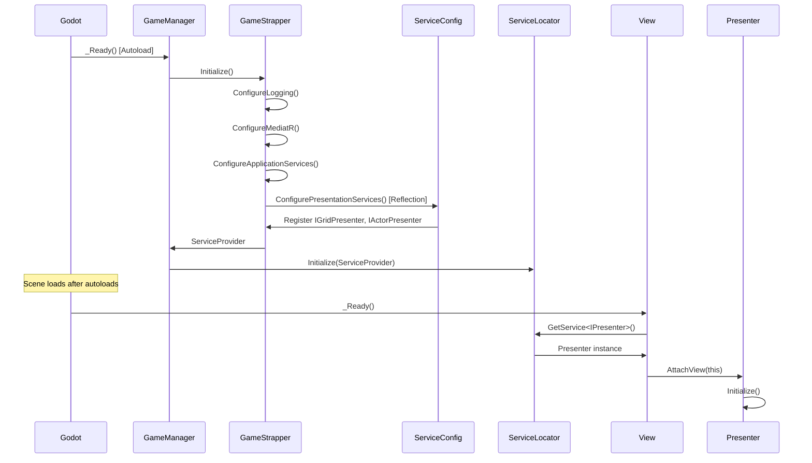

# Current Implementation Status

**Last Updated**: 2025-09-16 18:25
**Owner**: Product Owner (maintaining implementation truth)
**Purpose**: Ground truth of what's actually built vs what's planned

## 📊 Overall Progress

**Phase Status**: Architecture Foundation ✅ COMPLETE | Features 🚧 BLOCKED
**Build Status**: ✅ Compiles | ⚠️ Runtime DI Issues
**Test Coverage**: 661/664 passing (99.5%)

**Working Features**: None yet (fixing architecture issues)
**Current Blocker**: Presenter DI registration in Godot runtime

## 🏗️ Current Architecture (TD_046 Implementation)

### Project Structure
```
Solution Root/
├── src/
│   ├── Darklands.Domain/           # Pure domain, zero dependencies
│   ├── Darklands.Application/      # Application + Infrastructure
│   └── Darklands.Presentation/     # MVP Presenters (no Godot refs)
├── tests/
│   └── Darklands.Core.Tests/       # All test projects
├── GodotIntegration/               # Godot-specific code
│   ├── Core/
│   │   ├── GameManager.cs         # Main entry point, DI bootstrap
│   │   └── ServiceLocator.cs      # Autoload for service resolution
│   └── Views/
│       ├── GridView.cs            # Godot node implementations
│       └── ActorView.cs
└── Darklands.csproj                # Godot main project
```

### Startup Control Flow


### Dependency Injection Configuration

#### Core Services (GameStrapper)
- **Singleton Services**:
  - State services (GridState, ActorState, VisionState)
  - Schedulers (CombatScheduler)
  - Deterministic random
  - UI Event Bus
- **Transient Services**:
  - MediatR handlers
  - Command/Query handlers

#### Presentation Services (ServiceConfiguration)
- **Transient Services**:
  - IGridPresenter → GridPresenter
  - IActorPresenter → ActorPresenter
  - IAttackPresenter → AttackPresenter

### MVP Pattern Implementation

#### Late-Binding Architecture
```csharp
// Presenter created by DI without view
public GridPresenter(IMediator mediator, ILogger logger, ...)
    : base() // No view in constructor
{
    // Services injected
}

// View attaches itself after creation
public override void _Ready()
{
    var presenter = ServiceLocator.GetService<IGridPresenter>();
    presenter?.AttachView(this);
}
```

## ✅ What's Working

### Foundation (TD_046 Complete)
- **4-Project Clean Architecture**: Domain, Application, Presentation, Godot
- **Compile-time MVP enforcement**: Views can't bypass presenters
- **DI Container**: 60 services registered with proper lifetimes
- **Domain Model**:
  - Pure domain with zero external dependencies
  - TimeUnit value objects with full arithmetic/comparison
  - CombatAction records (dagger=500ms, sword=800ms, axe=1200ms)
  - Deterministic random system
- **Error Handling**: LanguageExt Fin<T> throughout all layers
- **Logging**: Unified Serilog with categories
- **Test Infrastructure**: 661 tests, 99.5% pass rate

## 🚧 What's Partial

### Application Layer (Phase 2)
- **MediatR Pipeline**: Configured but no commands/handlers yet
- **Timeline Scheduler**: Not started (VS_002 proposed)

## ❌ What's Not Started

### Infrastructure (Phase 3)
- State persistence
- Save/Load system
- Configuration management

### Presentation (Phase 4)
- Godot UI implementation
- View interfaces
- Input handling
- Turn order display

## 🎯 Next Logical Steps

1. **BR_001** (CRITICAL BUG): Remove float/double math from TimeUnitCalculator
   - Blocks VS_002 and all future development
   - Replace with deterministic integer math
   
2. **VS_002** (Critical): Implement Combat Timeline Scheduler
   - Simple priority queue with ISchedulable interface
   - MUST include unique Guid Id for every entity
   - ScheduleActorCommand and ProcessTurnCommand handlers
   - Target: <100 lines of logic

2. **TD_001** (Important): Create setup documentation
   - Now unblocked since VS_001 complete
   - Document tools and environment setup

3. **Phase 3 Planning**: After VS_002, define state persistence

## 🔍 Reality Check

### What Actually Works End-to-End
- **Build System**: ✅ Solution builds with zero warnings
- **Tests**: ✅ All 107 tests pass
- **DI Container**: ✅ Validates and resolves services
- **Domain Logic**: ✅ TimeUnit calculations work correctly

### Known Issues
- **CRITICAL**: Presenter DI registration failing at runtime
  - Presenters registered but still looking for views in constructors
  - Likely cached assembly issue in Godot's .mono directory
  - Fix implemented but not taking effect
- **CRITICAL**: Float/double math in TimeUnitCalculator (BR_001)
- No actual gameplay yet (foundation only)
- Godot project exists but has minimal implementation
- No commands/handlers using the MediatR pipeline yet

### Current Runtime Error
```
ERROR: Container build failed: Some services are not able to be constructed
- IGridPresenter: Unable to resolve IGridView while activating GridPresenter
- IActorPresenter: Unable to resolve IActorView while activating ActorPresenter
- IAttackPresenter: Unable to resolve IAttackView while activating AttackPresenter
```

**Root Cause**: Presenters still have old constructors requiring views despite code changes
**Likely Issue**: Godot loading cached Presentation.dll from .mono/temp
**Resolution Path**:
1. Clear Godot .mono/temp directory
2. Full rebuild of all projects
3. Restart Godot editor

### Technical Debt Already Accumulating
- None significant yet - clean foundation from VS_001

## 🔧 Service Resolution Details

### ServiceLocator Pattern
```csharp
// ServiceLocator.cs (Godot Autoload)
public partial class ServiceLocator : Node
{
    private static IServiceProvider? _serviceProvider;

    public static void Initialize(IServiceProvider provider)
    {
        _serviceProvider = provider;
    }

    public static T? GetService<T>() where T : class
    {
        return _serviceProvider?.GetService<T>();
    }
}
```

### View Service Resolution Extension
```csharp
// ServiceExtensions.cs
public static T? GetOptionalService<T>(this Node node) where T : class
{
    // Try scoped container first
    var scopedService = TryGetScopedService<T>(node);
    if (scopedService != null) return scopedService;

    // Fall back to global ServiceLocator
    return ServiceLocator.GetService<T>();
}
```

### Error Recovery Strategy
When presenters can't be resolved:
1. View logs error but continues
2. View operates in "headless" mode
3. No crashes, but no functionality

## 📈 Velocity Observations

- **VS_001**: Took 4-5 days (XL) - included critical bug fixes and comprehensive testing
- **TD_046**: Took 3 days (XXL) - complete architectural refactoring
- **DI Fix**: In progress (1 day) - assembly caching issues
- **Expected VS_002**: Blocked until DI issues resolved

## 🎮 Player-Visible Progress

**Current State**: No playable features yet
**Next Visible**: After Phase 4 of VS_002 - will show turn order in UI

## 🔥 Immediate Action Required

### To Fix Current DI Issue
```bash
# 1. Close Godot Editor completely
# 2. Clean cached assemblies
rm -rf .godot/mono/temp/*
rm -rf .mono/temp/*

# 3. Full rebuild
./scripts/core/build.ps1 clean
./scripts/core/build.ps1 build

# 4. Restart Godot and test
```

### Verification Steps
1. Check GameStrapper logs for "60 services" registered
2. Verify no constructor errors in presenter registration
3. Confirm Views can resolve presenters via ServiceLocator

### If Issue Persists
1. Check Presentation.dll timestamp in .godot/mono/temp/bin/Debug/
2. Manually copy from src/Darklands.Presentation/bin/Debug/net8.0/
3. Consider adding assembly version logging

---

*This document represents the actual state of implementation. Updated after each VS completion or significant discovery.*