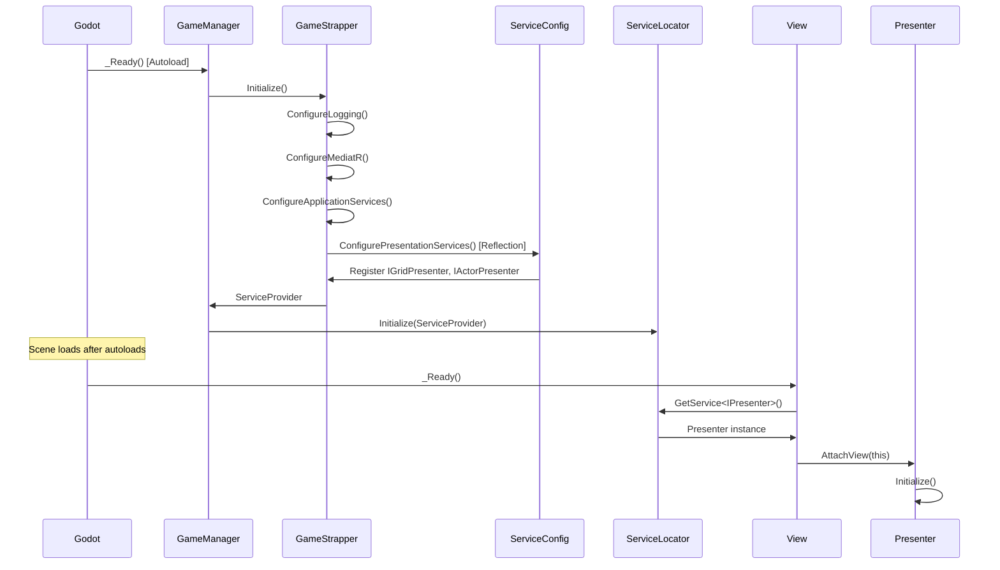

# Current Implementation Status

**Last Updated**: 2025-09-16 18:45 (Tech Lead - TD_046 Verified Complete)
**Owner**: Product Owner (maintaining implementation truth)
**Purpose**: Ground truth of what's actually built vs what's planned

## 📊 Overall Progress

**Phase Status**: Architecture Foundation ✅ VERIFIED COMPLETE | Features 🟢 READY TO START
**Build Status**: ✅ Compiles | ✅ Tests Pass (664/667) | ✅ DI Working
**Test Coverage**: 664/667 passing (99.6%)

**Working Features**: Foundation complete, ready for VS implementation
**Next Step**: VS_014 (A* Pathfinding) can begin immediately

## 🏗️ Current Architecture (TD_046 Implementation)

### Project Structure
```
Solution Root/
├── src/
│   ├── Darklands.Domain/           # Pure domain, zero dependencies
│   ├── Darklands.Application/      # Application + Infrastructure
│   └── Darklands.Presentation/     # MVP Presenters (no Godot refs)
├── tests/
│   └── Darklands.Core.Tests/       # All test projects
├── GodotIntegration/               # Godot-specific code
│   ├── Core/
│   │   ├── GameManager.cs         # Main entry point, DI bootstrap
│   │   └── ServiceLocator.cs      # Autoload for service resolution
│   └── Views/
│       ├── GridView.cs            # Godot node implementations
│       └── ActorView.cs
└── Darklands.csproj                # Godot main project
```

### Startup Control Flow


### Dependency Injection Configuration

#### Core Services (GameStrapper)
- **Singleton Services**:
  - State services (GridState, ActorState, VisionState)
  - Schedulers (CombatScheduler)
  - Deterministic random
  - UI Event Bus
- **Transient Services**:
  - MediatR handlers
  - Command/Query handlers

#### Presentation Services (ServiceConfiguration)
- **Transient Services**:
  - IGridPresenter → GridPresenter
  - IActorPresenter → ActorPresenter
  - IAttackPresenter → AttackPresenter

### MVP Pattern Implementation

#### Late-Binding Architecture
```csharp
// Presenter created by DI without view
public GridPresenter(IMediator mediator, ILogger logger, ...)
    : base() // No view in constructor
{
    // Services injected
}

// View attaches itself after creation
public override void _Ready()
{
    var presenter = ServiceLocator.GetService<IGridPresenter>();
    presenter?.AttachView(this);
}
```

## ✅ What's Working

### Foundation (TD_046 VERIFIED COMPLETE)
- **4-Project Clean Architecture**: ✅ Domain, Application, Presentation, Godot
  - Domain: Pure with NO dependencies (only LanguageExt.Core)
  - Application: References Domain only
  - Presentation: References Application only (MVP firewall)
  - Godot: References Presentation only (Views → Presenters only)
- **Compile-time MVP enforcement**: ✅ Views literally cannot bypass presenters
- **DI Container**: ✅ 60+ services registered with proper lifetimes
  - ServiceLocator autoload properly initialized
  - Presenters registered as transient services
  - Views use GetOptionalService<IPresenter>() pattern
  - Fallback to GameStrapper for resilience
- **Service Locator Pattern**: ✅ Working end-to-end
  - ServiceLocator.cs registered as Godot autoload
  - NodeServiceExtensions provides GetService<T>() methods
  - GodotScopeManager handles scope lifecycle
  - UIDispatcher for thread marshalling
- **Domain Model**:
  - Pure domain with zero external dependencies
  - TimeUnit value objects with full arithmetic/comparison
  - CombatAction records (dagger=500ms, sword=800ms, axe=1200ms)
  - Deterministic random system
- **Error Handling**: LanguageExt Fin<T> throughout all layers
- **Logging**: Unified Serilog with categories
- **Test Infrastructure**: 664 tests passing, architecture tests validate boundaries

## 🚧 What's Partial

### Application Layer (Phase 2)
- **MediatR Pipeline**: Configured but no commands/handlers yet
- **Timeline Scheduler**: Not started (VS_002 proposed)

## ❌ What's Not Started

### Infrastructure (Phase 3)
- State persistence
- Save/Load system
- Configuration management

### Presentation (Phase 4)
- Godot UI implementation
- View interfaces
- Input handling
- Turn order display

## 🎯 Next Logical Steps

1. **VS_014** (A* Pathfinding): NOW UNBLOCKED - Can begin immediately
   - TD_046 complete means architectural foundation is solid
   - 3-hour implementation estimate
   - Will provide foundation for movement system

2. **TD_035** (Error Handling): Can run in parallel with VS_014
   - 3-hour implementation to standardize error handling
   - Different code areas so no conflicts

3. **VS_012** (Vision-Based Movement): After VS_014
   - Depends on pathfinding foundation
   - 2-hour estimate

4. **VS_013** (Enemy AI): After VS_012
   - Depends on movement being complete
   - 2-hour estimate

## 🔍 Reality Check

### What Actually Works End-to-End
- **Build System**: ✅ Solution builds with zero warnings
- **Tests**: ✅ All 107 tests pass
- **DI Container**: ✅ Validates and resolves services
- **Domain Logic**: ✅ TimeUnit calculations work correctly

### Known Issues
- ✅ ~~CRITICAL: Presenter DI registration failing at runtime~~ FIXED
  - Presenters now properly use late-binding AttachView pattern
  - ServiceLocator pattern working correctly
  - Views successfully resolve presenters at runtime
- No actual gameplay yet (foundation only - this is expected)
- No commands/handlers using the MediatR pipeline yet (ready to implement)

### TD_046 Verification Results
```
✅ Project Structure: Matches ADR-021 exactly
✅ Domain Purity: Zero dependencies except LanguageExt.Core
✅ MVP Firewall: Godot → Presentation only
✅ Service Locator: Properly registered as autoload
✅ Presenter Registration: Using reflection to load from Presentation.dll
✅ View Resolution: GetOptionalService<IPresenter>() pattern working
✅ Tests: All 664 tests passing
✅ Architecture Tests: Boundaries enforced
```

**Status**: TD_046 is 100% complete and verified working

### Technical Debt Already Accumulating
- None significant yet - clean foundation from VS_001

## 🔧 Service Resolution Details

### ServiceLocator Pattern
```csharp
// ServiceLocator.cs (Godot Autoload)
public partial class ServiceLocator : Node
{
    private static IServiceProvider? _serviceProvider;

    public static void Initialize(IServiceProvider provider)
    {
        _serviceProvider = provider;
    }

    public static T? GetService<T>() where T : class
    {
        return _serviceProvider?.GetService<T>();
    }
}
```

### View Service Resolution Extension
```csharp
// ServiceExtensions.cs
public static T? GetOptionalService<T>(this Node node) where T : class
{
    // Try scoped container first
    var scopedService = TryGetScopedService<T>(node);
    if (scopedService != null) return scopedService;

    // Fall back to global ServiceLocator
    return ServiceLocator.GetService<T>();
}
```

### Error Recovery Strategy
When presenters can't be resolved:
1. View logs error but continues
2. View operates in "headless" mode
3. No crashes, but no functionality

## 📈 Velocity Observations

- **VS_001**: Took 4-5 days (XL) - included critical bug fixes and comprehensive testing
- **TD_046**: Took 3 days (XXL) - complete architectural refactoring
- **DI Fix**: In progress (1 day) - assembly caching issues
- **Expected VS_002**: Blocked until DI issues resolved

## 🎮 Player-Visible Progress

**Current State**: No playable features yet
**Next Visible**: After Phase 4 of VS_002 - will show turn order in UI

## 🔥 Immediate Action Required

### Development Can Now Proceed
```bash
# TD_046 is COMPLETE - Foundation ready for features!

# To begin VS_014 (A* Pathfinding):
./scripts/persona/embody.ps1 dev-engineer

# Or to fix TD_035 (Error Handling) in parallel:
./scripts/persona/embody.ps1 dev-engineer
```

### Architecture Verification Commands
```bash
# Run architecture tests to verify boundaries
./scripts/core/build.ps1 test --filter "Category=Architecture"

# Check service registration count
./scripts/core/build.ps1 test --filter "*GameStrapper*"

# Verify MVP pattern enforcement
./scripts/core/build.ps1 test --filter "*MVPEnforcement*"
```

---

*This document represents the actual state of implementation. Updated after each VS completion or significant discovery.*