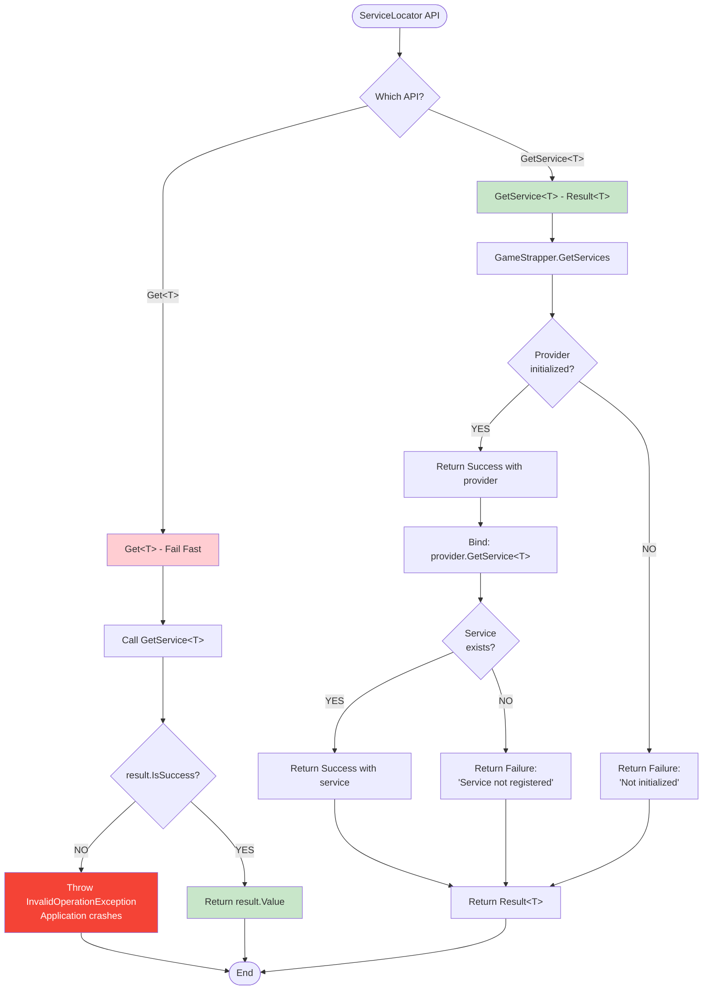

# Dependency Injection Foundation

**Status**: Active - Maintained Documentation
**Created**: 2025-09-30
**Last Updated**: 2025-09-30 14:32
**Implemented By**: VS_002
**Related**: [ADR-002: Godot Integration Architecture](../03-Reference/ADR/ADR-002-godot-integration-architecture.md)

---

## Overview

This document describes the Microsoft.Extensions.DependencyInjection foundation for Darklands, establishing a bridge between pure C# Core logic and Godot's scene-based instantiation model.

**Key Achievement**: Clean separation between Core (constructor injection) and Presentation (ServiceLocator bridge) while maintaining testability and architectural integrity.

**Maintenance**: This is a living document. Update when:
- New services are registered
- Bootstrap sequence changes
- Troubleshooting patterns emerge
- Performance characteristics change

---

## Architecture Summary

### Three-Layer Design


### Component Responsibilities

| Component | Location | Purpose | Testability |
|-----------|----------|---------|-------------|
| `GameStrapper` | Core/Application/Infrastructure | Builds DI container, registers services | ✅ Fully testable |
| `ServiceLocator` | Core/Infrastructure/DependencyInjection | Bridges Godot → DI | ✅ Fully testable |
| Godot Nodes | Presentation | Resolve services in `_Ready()` | ⚠️ Manual testing |

---

## Control Flow: Application Bootstrap

### Application Startup Sequence


`✶ Insight ─────────────────────────────────────`
**Bootstrap Timing is Critical**: Godot fires `_Ready()` callbacks in scene tree order. The root node (`Main`) must initialize the DI container before any child nodes attempt to resolve services. Using `SetMeta("SystemReady", true)` allows defensive nodes to check initialization status, though most production code uses fail-fast (crash if DI not ready).
`─────────────────────────────────────────────────`

---

## Control Flow: Container Initialization

### GameStrapper.Initialize() (Thread-Safe, Idempotent)


**Key Properties**:
- **Thread-Safe**: Lock protects initialization from race conditions
- **Idempotent**: Safe to call multiple times (returns success if already initialized)
- **Functional**: Returns `Result<T>` instead of throwing exceptions
- **Disposal-Aware**: `Reset()` properly disposes service provider (test-only)

---

## Control Flow: Service Resolution

### ServiceLocator Resolution Paths



**Two APIs, Two Use Cases**:

| Method | Return Type | Use Case | Error Behavior |
|--------|-------------|----------|----------------|
| `GetService<T>()` | `Result<T>` | When initialization uncertain | Returns `Result.Failure` |
| `Get<T>()` | `T` | After bootstrap verified | Throws exception (fail-fast) |

`✶ Insight ─────────────────────────────────────`
**Why Two APIs?** `GetService<T>()` returns `Result<T>` for graceful error handling during uncertain initialization phases. `Get<T>()` throws exceptions (fail-fast) for post-bootstrap scenarios where missing services indicate misconfiguration. Most Godot nodes use `Get<T>()` because if DI isn't ready, the application should crash immediately rather than silently failing.
`─────────────────────────────────────────────────`

---

## Control Flow: Service Lifetime

### Singleton Service Resolution


**Singleton Guarantees**:
- ✅ Single instance per container lifetime
- ✅ Thread-safe creation (DI container handles locking)
- ✅ Disposed when container is disposed
- ⚠️ **New container after `Reset()` creates NEW instances**

---

## Control Flow: Container Reset

### Reset Lifecycle (Test-Only)


**⚠️ CRITICAL**: `Reset()` is `internal` for **test isolation only**. Production code should **NEVER** call this. If you need graceful shutdown, a public `Shutdown()` method should be added in the future.

---

## Common Patterns

### Pattern 1: Resolving Service in Godot Node

```csharp
public partial class HealthBarNode : Node2D
{
    private IMediator? _mediator;
    private ILogger<HealthBarNode>? _logger;

    public override void _Ready()
    {
        base._Ready();

        // ✅ Resolve services via ServiceLocator (Godot boundary pattern)
        _logger = ServiceLocator.Get<ILogger<HealthBarNode>>();
        _mediator = ServiceLocator.Get<IMediator>();

        _logger.LogDebug("HealthBarNode initialized");
    }

    private async void OnDamageButtonPressed()
    {
        // ✅ Use cached resolved services
        await _mediator.Send(new TakeDamageCommand(...));
    }
}
```

**Why This Works**:
- `_Ready()` is called AFTER `Main._Ready()` initializes container
- ServiceLocator bridges Godot's instantiation → DI container
- Services cached as fields (resolved once, used many times)
- Fail-fast: If DI not ready, application crashes immediately

### Pattern 2: Core Handler with Constructor Injection

```csharp
public class ExecuteAttackCommandHandler : IRequestHandler<ExecuteAttackCommand>
{
    private readonly ILogger<ExecuteAttackCommandHandler> _logger;
    private readonly IActorRepository _actors;

    // ✅ Constructor injection (standard DI pattern)
    public ExecuteAttackCommandHandler(
        ILogger<ExecuteAttackCommandHandler> logger,
        IActorRepository actors)
    {
        _logger = logger;
        _actors = actors;
    }

    public async Task<Result> Handle(ExecuteAttackCommand cmd, CancellationToken ct)
    {
        _logger.LogInformation("Executing attack from {AttackerId}", cmd.AttackerId);

        // ✅ Business logic uses injected dependencies
        var attacker = await _actors.GetActor(cmd.AttackerId);
        // ...
    }
}
```

**Why This Works**:
- Core code has ZERO knowledge of ServiceLocator
- Dependencies are explicit (visible in constructor signature)
- Fully testable with mocked dependencies
- DI container resolves dependencies automatically via MediatR

---

## Architectural Boundaries

### What ServiceLocator Should Do

✅ **Bridge Godot instantiation to DI** (in `_Ready()` methods only)
✅ **Resolve services that can't be constructor-injected** (Godot nodes)
✅ **Fail-fast when services unavailable** (post-bootstrap)
✅ **Return Result<T> when initialization uncertain** (pre-bootstrap)

### What ServiceLocator Should NOT Do

❌ **Be used in Core project** (Core uses constructor injection)
❌ **Be called outside _Ready()** (cache services as fields)
❌ **Replace dependency injection** (it's a bridge, not a replacement)
❌ **Be used for business logic** (only for wiring)

`✶ Insight ─────────────────────────────────────`
**Service Locator as Anti-Pattern**: In enterprise software, ServiceLocator is considered an anti-pattern because it hides dependencies. However, at framework boundaries where the framework controls instantiation (like Godot), it's a pragmatic solution. We limit it to the **thinnest possible boundary** (`_Ready()` methods) and keep Core pure with constructor injection.
`─────────────────────────────────────────────────`

---

## Performance Considerations

### Initialization Cost

| Operation | Time | Frequency | Impact |
|-----------|------|-----------|--------|
| `Initialize()` | ~5-10ms | Once per app lifetime | Negligible |
| `GetService<T>()` | ~0.1ms | Per `_Ready()` call | Low |
| Service creation (Singleton) | ~0.01ms | Once per service | Negligible |
| Service resolution (cached) | ~0.001ms | Subsequent calls | Negligible |

### Optimization Guidelines

✅ **DO cache resolved services** as node fields (resolve once in `_Ready()`)
✅ **DO use Singleton lifetime** for stateless services (default)
⚠️ **CONSIDER Transient lifetime** for stateful services (use sparingly)
❌ **DON'T resolve services in `_Process()`** (called every frame!)

### Bad Example (Performance Issue)

```csharp
// ❌ WRONG: Resolves service every frame (60 FPS = 60 resolutions/second)
public override void _Process(double delta)
{
    var mediator = ServiceLocator.Get<IMediator>(); // BAD!
    // ...
}
```

### Good Example (Optimized)

```csharp
private IMediator? _mediator;

public override void _Ready()
{
    // ✅ CORRECT: Resolve once, cache as field
    _mediator = ServiceLocator.Get<IMediator>();
}

public override void _Process(double delta)
{
    // ✅ Use cached reference (no resolution cost)
    await _mediator.Send(...);
}
```

---

## Registered Services

### Current Services (as of VS_002)

| Service | Interface | Lifetime | Purpose |
|---------|-----------|----------|---------|
| TestService | `ITestService` | Singleton | ⚠️ Temporary validation service - remove after VS_001 |

### Future Services

| Service | Interface | Lifetime | Planned In |
|---------|-----------|----------|------------|
| Logging | `ILogger<T>` | Singleton | VS_003 |
| Event Bus | `IGodotEventBus` | Singleton | VS_004 |
| MediatR | `IMediator` | Singleton | VS_001 |
| Component Registry | `IComponentRegistry` | Singleton | VS_001 |

**Maintenance**: Update this table when new services are registered in `GameStrapper.RegisterCoreServices()`.

---

## Testing Strategy

### Test Categories

**Phase 1 Tests** (`[Trait("Category", "Phase1")]`):
- `Initialize_ShouldSucceed_OnFirstCall()` - Happy path
- `Initialize_ShouldBeIdempotent_WhenCalledMultipleTimes()` - Thread safety
- `GetServices_ShouldReturnFailure_BeforeInitialization()` - Error path
- `GetServices_ShouldReturnServiceProvider_AfterInitialization()` - Resolution
- `Initialize_ShouldRegisterTestService()` - Service registration
- `Initialize_ShouldRegisterSingletonServices_WithSingletonLifetime()` - Lifecycle

**Phase 2 Tests** (`[Trait("Category", "Phase2")]`):
- `GetService_ShouldReturnFailure_BeforeInitialization()` - Fail-safe
- `GetService_ShouldReturnSuccess_AfterInitialization()` - Resolution
- `GetService_ShouldReturnFailure_WhenServiceNotRegistered()` - Error handling
- `Get_ShouldReturnService_AfterInitialization()` - Fail-fast API
- `Get_ShouldThrow_WhenServiceNotAvailable()` - Exception behavior
- `GetService_ShouldReturnSingletonInstances_WithinSameContainer()` - Singleton
- `GetService_ShouldReturnNewInstances_AfterContainerReset()` - Reset behavior

### Test Execution

```bash
# Run Phase 1 tests (GameStrapper)
dotnet test --filter "Category=Phase1"
# Expected: 6 tests pass in <100ms

# Run Phase 2 tests (ServiceLocator)
dotnet test --filter "Category=Phase2"
# Expected: 7 tests pass in <100ms

# Run all DI Foundation tests
dotnet test --filter "Category=Phase1|Category=Phase2"
# Expected: 13 tests pass in <100ms
```

---

## Troubleshooting

### Common Issues

**Issue**: `InvalidOperationException: DI container not initialized`
**Cause**: ServiceLocator called before `GameStrapper.Initialize()`
**Fix**: Ensure Main scene root calls `Initialize()` first, or check `SystemReady` metadata

**Issue**: `Service not registered in DI container`
**Cause**: Forgot to add service to `RegisterCoreServices()`
**Fix**: Add service registration in `GameStrapper.RegisterCoreServices()`

**Issue**: Test fails with "Cannot access disposed object"
**Cause**: Test calls `Reset()` then tries to use old service reference
**Fix**: Re-resolve service after `Reset()` - don't hold references across resets

**Issue**: Services have stale state between tests
**Cause**: Singleton services persist across tests without `Reset()`
**Fix**: Call `GameStrapper.Reset()` in test `Arrange` phase

---

## Extension Points

### Adding New Service

```csharp
// In GameStrapper.RegisterCoreServices()
private static void RegisterCoreServices(IServiceCollection services)
{
    // Existing services...
    services.AddSingleton<ITestService, TestService>();

    // ✅ Add new service here
    services.AddSingleton<IMyService, MyService>();
}
```

### Custom Service Lifetime

```csharp
// Different lifetime options
services.AddTransient<ICommandFactory, CommandFactory>(); // New instance each time
services.AddScoped<IUnitOfWork, UnitOfWork>();           // Per scope (future)
services.AddSingleton<IActorRepository, ActorRepository>(); // Single instance (default)
```

### Conditional Registration

```csharp
// Register different implementations based on environment
if (Environment.IsDevelopment)
{
    services.AddSingleton<IDataStore, InMemoryDataStore>();
}
else
{
    services.AddSingleton<IDataStore, FileDataStore>();
}
```

---

## Future Enhancements

### Planned Improvements

1. **Graceful Shutdown** (Future VS):
   ```csharp
   public static Result Shutdown()
   {
       // Dispose all services, release resources
       // Make Reset() logic public for production use
   }
   ```

2. **Service Validation** (Future VS):
   ```csharp
   // Validate all services can be resolved at startup
   public static Result ValidateServices()
   {
       // Try to resolve each registered service
       // Return errors for missing dependencies
   }
   ```

3. **Configuration Integration** (Future VS):
   ```csharp
   services.AddOptions<GameSettings>()
       .Configure(settings => {
           // Load from config file
       });
   ```

---

## References

### Related Documentation
- [ADR-002: Godot Integration Architecture](../03-Reference/ADR/ADR-002-godot-integration-architecture.md) - Overall architecture
- [ADR-003: Functional Error Handling](../03-Reference/ADR/ADR-003-functional-error-handling.md) - Result<T> pattern
- [Backlog: VS_002](Backlog.md#vs_002-infrastructure---dependency-injection-foundation) - Original implementation

### External Resources
- [Microsoft.Extensions.DependencyInjection Docs](https://learn.microsoft.com/en-us/dotnet/core/extensions/dependency-injection)
- [Service Locator Pattern Discussion](https://blog.ploeh.dk/2010/02/03/ServiceLocatorisanAnti-Pattern/)
- [CSharpFunctionalExtensions](https://github.com/vkhorikov/CSharpFunctionalExtensions)

---

**Document Status**: ✅ Active - Maintained
**Last Reviewed**: 2025-09-30
**Next Review**: After VS_003 (Logging System) implementation
**Maintenance Owner**: Tech Lead