# Backlog Workflow

## 📝 Quick Start Checklist
1. **Run embody [persona]** - v4.0 auto-syncs and loads context automatically
2. **Check Memory Bank** if needed: `.claude/memory-bank/active/[persona].md`
3. **Review patterns**: `.claude/memory-bank/patterns.md` 
4. **Understand decisions**: `.claude/memory-bank/decisions.md`
5. **Then proceed** with workflow below

### Branch Workflow Integration
**CRITICAL**: AI personas must make intelligent branch decisions before starting work.

**NEW: Automatic Sync Resolution** 🎯
- Use `git sync` instead of manual pull/rebase - handles squash merges automatically
- After PR merge: `pr merge` or `git sync` - no manual conflict resolution needed
- Embody v4.0 auto-syncs on every persona switch

**Quick Decision Guide:**
- **On main?** → Always create feature branch for work items
- **Different work item?** → New branch (feat/VS_XXX, tech/TD_XXX, fix/BR_XXX)  
- **Quick fix (<30min)?** → Consider staying on current branch
- **Multi-session work?** → New branch required
- **Stale branch (>10 commits behind)?** → Consider fresh branch

**Complete Protocols**: [BranchAndCommitDecisionProtocols.md](../02-Design/Protocols/BranchAndCommitDecisionProtocols.md)

## 🔄 Model-First Implementation Protocol (ADR-006)

### Core Principle: Build Inside-Out
All features MUST be implemented in strict phases, starting with pure domain logic and expanding outward. **NO EXCEPTIONS**.

### Phase Progression (MANDATORY)
```
Phase 1: Domain      Phase 2: Application    Phase 3: Infrastructure    Phase 4: Presentation
   ↓                      ↓                         ↓                          ↓
Pure C# Logic        Commands/Handlers         State/Services              Godot/UI
Unit Tests           Handler Tests             Integration Tests           Manual/E2E
(<100ms)             (<500ms)                  (<2s)                       (Variable)
```

### Phase Gates (Enforced by CI)
- ❌ **CANNOT** skip phases - even for "simple" features
- ❌ **CANNOT** start next phase until current has GREEN tests
- ✅ **MUST** commit at each phase completion
- ✅ **MUST** use phase marker in commit: `feat(X): domain [Phase 1/4]`

### Implementation Timeline Example
```
Day 1 Morning:   Phase 1 - Domain Model (2h)
Day 1 Afternoon: Phase 2 - Application Layer (1h)
Day 1 Late:      Phase 3 - Infrastructure (1h)
Day 2 Morning:   Phase 4 - Presentation (2h)
```

### Why This Matters
- **Bug Detection**: Logic errors caught in milliseconds, not runtime
- **Refactoring Safety**: Change domain without touching UI
- **Test Speed**: Core tests stay fast as codebase grows
- **Clear Dependencies**: Each layer only knows layers below

### VS Item Phase Tracking
```markdown
VS_042: Block Merging
Status: Phase 2/4 Complete ← NEW: Phase progress
Owner: Dev Engineer
Phases:
  ✅ Domain Model (tests passing)
  ✅ Application Layer (handlers done)
  ⏳ Infrastructure (in progress)
  ⬜ Presentation (not started)
```

**Complete Details**: [ADR-006](../03-Reference/ADR/ADR-006-model-first-implementation-protocol.md) | **Reference**: [Move Block Pattern](../../src/Features/Block/Move/)

## 🧠 Owner-Based Ultra-Think Protocol

### Core Principle
Each backlog item has a **single Owner** who is responsible for decisions and progress. When embodying a persona:

1. **Filter** for items you own
2. **Check branch alignment** with current work item (use branch status script)
3. **Ultra-Think** if Status=Proposed (automatic 5-15 min deep analysis)
4. **Quick Scan** other owned items (<2 min updates)
5. **Update** backlog with decisions
6. **Reassign** owner when handing off

### Branch Alignment During Persona Work
**Before starting implementation work:**
- Verify current branch matches work item scope
- Create new branch if working on different item type (VS→TD, TD→BR)
- Use branch cleanup automation for merged/stale branches
- Follow atomic commit guidance during implementation

### Ultra-Think Triggers
- **Automatic**: Owner + Status=Proposed
- **Markers**: [ARCHITECTURE], [ROOT-CAUSE], [SAFETY-CRITICAL], [COMPLEX]
- **Output**: Decision rationale documented in item

## 🚀 OPTIMIZED: Focus + Delegation Pattern

### The Efficiency Breakthrough
**Discovery**: Personas waste 30% of time on mechanical backlog tasks instead of their core expertise.

### The Solution: Suggest Updates, User Executes
```bash
# OLD WAY (inefficient):
Tech Lead reviews → Manually updates backlog → Formats items → Archives
Time: 20 minutes (5 min thinking + 15 min mechanical work)

# CORRECTED WAY (efficient + user control):
Tech Lead reviews → Makes decision → Suggests backlog update → User chooses to delegate
Time: 7 minutes (5 min thinking + 2 min suggestion)
```

### How to Suggest (Not Auto-Execute)
```bash
# After making your decision, present as bullet points:
**Suggested backlog updates:**
- Move TD_013 to Critical
- Update status to Approved
- Add my decision notes
- Archive completed items

# User can request command generation if needed
```

### Verification After Updates
When subagent completes work, verify with:
- `./scripts/verify-subagent.ps1 -Type backlog`
- Or manual: `git status | grep Backlog.md`
- See HANDBOOK.md > Subagent Verification section

### What Each Persona Suggests (User Executes)
| Persona | Focus On (High-Value) | Suggests for User (Not Auto-Execute) |
|---------|----------------------|--------------------------------------|
| **Product Owner** | Feature definition, value prop | Creating VS items, formatting |
| **Tech Lead** | Technical decisions, architecture | Moving items, status updates |
| **Dev Engineer** | Writing code, solving problems | Progress updates, creating TD |
| **Test Specialist** | Finding bugs, validation | Creating BR items, formatting |
| **Debugger Expert** | Root cause analysis | Updating BR status, archiving |
| **DevOps** | CI/CD, automation | TD proposals, documentation |
| **Strategic Prioritizer** | Meta-analysis (EXCEPTION) | Auto-invokes backlog-assistant for analysis |

### The Results
- **30% time savings** per persona per session
- **Better focus** on core expertise
- **User maintains control** over backlog changes
- **Consistent formatting** when user chooses to delegate
- **Higher quality decisions** with proper separation of concerns

### 🤖 Git Automation Support (v4.0)
The persona system now includes automatic git state resolution:
- **Squash merges handled automatically** - No manual conflict resolution
- **Embody auto-syncs** - Every persona switch ensures clean state
- **Smart sync** - `git sync` chooses optimal strategy (reset vs rebase)
- Focus on your work, not git mechanics!

### ⚠️ CRITICAL: Backlog-Assistant Protocol

**CORRECTED RULE**: Personas SUGGEST backlog updates, they do NOT auto-invoke backlog-assistant.

**Exception**: Strategic Prioritizer auto-invokes for meta-analysis (this is its designed function).

**Why This Matters**:
- Preserves user control over backlog management
- Prevents status updates without proper review
- Maintains separation between decision-making and mechanical execution
- Ensures Tech Lead review happens before marking items complete

**Correct Pattern**: Suggest → User Decides → Optional Delegation

## 🎯 Strategic Prioritizer - The Meta Layer

### When to Use the Strategic Prioritizer
The Strategic Prioritizer is your **architectural advisor** that helps decide WHAT to work on:

1. **Start of each work session**: "What should I work on today?"
2. **After completing a task**: "What's next?"
3. **When feeling overwhelmed**: "Help me focus"
4. **Weekly planning**: "What's the strategic view?"

### How the Prioritizer Works
```
embody strategic-prioritizer
    ↓
Scans ALL items (Backlog + Ideas + Archive)
    ↓
Analyzes with architectural knowledge
    ↓
Outputs Top 3 recommendations with reasoning
    ↓
You pick one and embody the owner persona
```

### The Prioritizer's Knowledge Evolution
- **Learns from outcomes**: Updates velocity metrics
- **Remembers failures**: Prevents repeated mistakes
- **Tracks patterns**: Knows what works
- **Resurrects items**: Brings back relevant archived work
- **Maintains memory**: PrioritizerKnowledge.md is its brain

### Integration with Workflow
```
Strategic Prioritizer: "Work on TD_003 next (Score: 95)"
    ↓
You: embody dev-engineer
    ↓
Dev Engineer: Implements TD_003
    ↓
Strategic Prioritizer: Learns from outcome, updates knowledge
```

## Work Item Types & Default Ownership

| Type | Description | Creator | Initial Owner | Handoff Flow |
|------|-------------|---------|---------------|---------------|
| **VS** | Vertical Slice (Feature) | Product Owner | Product Owner → Tech Lead → Dev Engineer | Define → Break down → Implement |
| **BR** | Bug Report | Test Specialist | Test Specialist → Debugger Expert | Discover → Investigate |
| **TD** | Technical Debt | Anyone | Tech Lead → Dev Engineer | Review → Implement |

## The Flow

```
Product Owner → Tech Lead → Dev Engineer → Test Specialist → DevOps
     (VS)       (Validate)     (BUILD)      (BR/TD)       (CI/CD)
                    ↓                           ↓
                (TD approve)            Debugger Expert (OWNS BR)
```

### Branch Considerations During Handoffs
- **Product Owner → Tech Lead**: Usually same branch (review phase)
- **Tech Lead → Dev Engineer**: New branch if implementing approved item (feat/VS_XXX)
- **Dev Engineer → Test Specialist**: Same branch (testing implementation)
- **Test Specialist → DevOps**: Same branch (CI/CD validation) OR new branch for deployment
- **Bug Discovery**: New branch for BR items (fix/BR_XXX-description)

**Key Principle**: Branch alignment with work item type and persona scope

## VS (Vertical Slice) Flow with Ownership
```
Product Owner creates VS (Status: Proposed, Owner: Product Owner)
    ↓ [Ultra-Think: Define scope and value]
Product Owner completes definition (Owner: Tech Lead)
    ↓ [Ultra-Think: Architecture review]
Tech Lead reviews (Status: Under Review)
    ↓
[Validates: thin, independent, shippable]
    ↓                    ↓
Approved               Needs Refinement
(Owner: Dev Engineer)  (Owner: Product Owner)
    ↓                    ↓
Ready for Dev      (back to refine scope)
    ↓
Dev Engineer implements (Status: In Progress)
    ↓ [Quick Scan mode]
[Runs ./scripts/core/build.ps1 test (build+tests) locally]
    ↓
Creates PR → CI/CD runs (Owner: Test Specialist)
    ↓
Test Specialist validates (Status: Testing)
    ↓ [Ultra-Think if complex edge cases]
[Checks functionality AND code quality]
    ↓                    ↓
Passes                Quality Issues
    ↓                    (Owner: Tech Lead for TD)
CI passes & merged   Proposes TD item
    ↓                    ↓
(Status: Done)      (Continues testing)
```

## TD (Tech Debt) Flow with Ownership
```
Anyone proposes TD (Status: Proposed, Owner: Tech Lead)
(Including Test Specialist during quality validation)
    ↓ [Ultra-Think: Architecture review]
Tech Lead reviews (automatic ultra-think trigger)
    ↓
Approved                Rejected
(Owner: Dev Engineer)   (Owner: Closed)
    ↓                  ↓
Implements              Document reason
    ↓
(Status: Done)
```

## BR (Bug) Flow with Ownership
```
Test Specialist creates BR (Status: Reported, Owner: Test Specialist)
    ↓ [Quick assessment]
Hands off to Debugger (Owner: Debugger Expert)
    ↓ [Ultra-Think: Root cause analysis]
Debugger Expert investigates (Status: Investigating)
    ↓ [Deep investigation mode]
Debugger proposes fix (Status: Fix Proposed)
    ↓
User approves → (Owner: Dev Engineer)
    ↓
Dev Engineer implements (Status: Fix Applied)
    ↓
(Owner: Test Specialist) verifies
    ↓
[If significant bug]
    ↓
Debugger Expert creates post-mortem
    ↓
Debugger consolidates lessons → Updates docs
    ↓
Debugger AUTOMATICALLY archives (mandatory)
```

## Status Updates & Ownership

### Who Updates What (Based on Ownership)
- **Product Owner**: Creates VS, defines scope (owns until handed to Tech Lead)
- **Tech Lead**: Reviews all Proposed items they own, approves/rejects TD
- **Dev Engineer**: Updates items they own from Approved → In Progress → Done
- **Test Specialist**: Creates BR, validates features they own
- **Debugger Expert**: Owns all BR investigations (automatic ultra-think)
- **DevOps**: Updates CI/CD status for items they own

### Ownership Transfer Points
- VS: Product Owner → Tech Lead → Dev Engineer → Test Specialist
- BR: Test Specialist → Debugger Expert → Dev Engineer → Test Specialist
- TD: Anyone → Tech Lead → Dev Engineer
- **Anyone**: Can propose TD items (Test Specialist commonly does during testing)

### Status Progression

**VS Items:**
```
Proposed → Under Review → Ready for Dev → In Progress → Testing → Ready for Human Testing 👁️ → Done
    ↓           ↓                                           ↓
    ↓    Needs Refinement                                   ↓
    ↓           ↓                                    (If unit tests fail)
    └───────────┘ (back to Product Owner)
```

**TD Items:**
```
Proposed → Approved → In Progress → Done
    ↓
Rejected
```

**BR Items:**
```
Reported → Investigating → Fix Proposed → Fix Applied → Verified
                ↓
        (Can loop back if fix fails)
```

## 🧪 Testing Responsibilities Matrix

### Clear Division: AI vs Human Testing

| Test Type | AI Can Do ✅ | Human Must Do 👁️ | Why |
|-----------|--------------|-------------------|-----|
| **Unit Tests** | Write, run, validate | Review coverage | AI has full code access |
| **Integration Tests** | Write, run, validate | Verify assumptions | AI can test code interactions |
| **Property Tests** | Design properties, generate | Verify edge cases found | AI excels at invariant testing |
| **E2E Visual Tests** | ❌ Generate test plans only | Execute in Godot | AI cannot see or click UI |
| **Animation Tests** | ❌ Describe expected behavior | Verify smoothness | AI cannot perceive motion |
| **User Experience** | ❌ Create test scenarios | Feel and validate | AI cannot judge "feels right" |
| **Performance Tests** | Run benchmarks, analyze | Verify in-game feel | AI sees numbers, not stutters |

### The Testing Handoff Protocol

```mermaid
graph LR
    A[Dev Complete] --> B[AI: Run Unit/Integration Tests]
    B --> C{All Pass?}
    C -->|No| D[Fix & Retry]
    C -->|Yes| E[AI: Generate E2E Checklist]
    E --> F[Status: Ready for Human Testing 👁️]
    F --> G[Human: Execute E2E Tests]
    G --> H{Pass?}
    H -->|No| I[Create BR Item]
    H -->|Yes| J[Status: Done ✅]
```



### Human Testing Checklist Generation

When Test Specialist marks an item as **"Ready for Human Testing 👁️"**, they generate:

```markdown
## E2E Testing Checklist: [Feature Name]
Generated: [Date]
Feature: [VS/BR/TD Number]

### Setup
- [ ] Ensure latest build from main
- [ ] Clear any test data
- [ ] Set window to 1920x1080

### Core Functionality
- [ ] **Test 1**: [Specific action]
  - Click [specific button/area]
  - Expected: [exact visual result]
  - Edge case: [what might break]

- [ ] **Test 2**: [Another action]
  - Drag from [A] to [B]
  - Expected: [animation description]
  - Verify: [specific visual feedback]

### Visual Validation
- [ ] No flickering during [action]
- [ ] Smooth animation at 60fps
- [ ] Correct colors (#4169E1 for Work blocks)
- [ ] Proper layering (UI on top)

### Edge Cases
- [ ] Spam-click [button] - should not break
- [ ] Drag outside bounds - should snap back
- [ ] Window resize - layout should adapt

### Performance
- [ ] FPS counter stays above 55
- [ ] No memory leaks after 5 minutes
- [ ] Responsive during rapid actions

### Sign-off
- [ ] All core tests passed
- [ ] No visual glitches observed
- [ ] Performance acceptable
- [ ] Ready for production

Tester: ________________
Date: ________________
```

### Important Testing Rules

1. **AI NEVER marks "Done"** without human E2E validation for UI features
2. **Status "Ready for Human Testing 👁️"** = Unit tests pass, needs visual validation
3. **Human test results** go in backlog item as comments
4. **Failed E2E** creates BR item with exact reproduction steps
5. **Test Specialist** generates checklist but doesn't execute visual tests

## Priority Tiers

- **🔥 Critical**: Blockers, crashes, data loss, dependencies
- **📈 Important**: Current milestone, active work
- **💡 Ideas**: Future considerations

**Note**: Critical bugs are just BR items with 🔥 priority - no special "hotfix" type needed.

## Quick Rules

1. **One owner per item** - No shared responsibility
2. **Update on state change** - Not every minor step
3. **BR for bugs** - Not BF (Bug Fix)
4. **TD for quality issues** - Test Specialist proposes during testing (Tech Lead approves)
5. **User approves fixes** - Debugger can't autonomously fix
6. **Single source**: `Docs/01-Active/Backlog.md`
7. **Quality gates**: Test Specialist blocks if untestable, proposes TD if messy
8. **CI/CD gates**: Build+tests must pass locally (`./scripts/core/build.ps1 test`) and pre-commit hook enforces this
9. **PR requirements**: CI must pass on GitHub before merge

## 🔧 Build Error Troubleshooting

### Common Build Errors & Solutions

| Error | Cause | Solution |
|-------|-------|----------|
| **"Type or namespace not found"** | Wrong namespace assumption | Run `Grep "class ClassName"` to find actual location |
| **"Ambiguous reference between X and Y"** | Multiple types with same name | Add type alias: `using LangError = LanguageExt.Common.Error;` |
| **"Cannot convert lambda expression"** | Match branches return different types | Ensure all branches return same type (e.g., `Unit.Default`) |
| **"Error is an ambiguous reference"** | Godot.Error vs LanguageExt.Error | Use fully qualified: `LanguageExt.Common.Error.New()` |

### Prevention Checklist
Before building after refactoring:
- [ ] Verified namespaces with `Grep "class ClassName"`
- [ ] Added type aliases for any ambiguous types
- [ ] Checked all Match branches return consistent types
- [ ] Ran `./scripts/core/build.ps1 test` locally (build+tests)
- [ ] Fixed any namespace conflicts with type aliases

### Pre-Implementation Checklist (Context7 Integration)
Before writing code with unfamiliar APIs:
- [ ] **Query Context7 for framework documentation** (prevents assumption bugs)
  - [ ] LanguageExt error handling patterns if using `Fin<T>` or `Error`
  - [ ] MediatR handler registration if creating new handlers
  - [ ] Godot lifecycle methods if overriding Node methods
- [ ] **Verify methods exist** before overriding (`mcp__context7__get-library-docs`)
- [ ] **Check DI registration requirements** for new services
- [ ] **Review existing patterns** in `src/Features/Block/Move/`
- [ ] **Map integration points** if replacing features (find ALL old code)

### Branch-Related Troubleshooting
| Issue | Cause | Solution |
|-------|-------|----------|
| **"Merge conflicts"** | Branch behind main | `git rebase origin/main` or create fresh branch |
| **"PR already exists"** | Working on merged branch | Run `./scripts/branch-cleanup.ps1` to clean up |
| **"No such branch"** | Branch name mismatch | Use `./scripts/git/branch-status-check.ps1` for guidance |
| **"Working on wrong item"** | Branch/work item misalignment | Create new branch for current work item |

### Quick Commands
```bash
# NEW: Smart sync (handles squash merges automatically)
git sync

# NEW: PR workflow with auto-sync
pr create   # Create PR from current branch
pr merge    # Merge PR and auto-sync dev/main
pr status   # Check PR and sync status

# Check branch intelligence before starting work
./scripts/git/branch-status-check.ps1

# Clean up merged branches automatically
./scripts/branch-cleanup.ps1

# Find where a class is actually defined
Grep "class PlaceBlockCommand" src/

# Find all usages of a type
Grep "PlaceBlockCommand" --type cs

# Build + test locally before committing (NEW - single command is safe!)
./scripts/core/build.ps1 test

# For rapid development iteration (tests only, NOT for commits)
./scripts/core/build.ps1 test-only
```

## Post-Mortem Lifecycle (Debugger Expert Owns)

**MANDATORY FLOW**: Create → Consolidate → Archive

1. **Create** post-mortem for significant bugs (>30min fix or systemic issue)
2. **Consolidate** lessons into:
   - Framework gotchas → HANDBOOK.md
   - Process improvements → Workflow.md
   - API examples → Context7Examples.md
3. **Archive AUTOMATICALLY** to `Post-Mortems/Archive/YYYY-MM-DD-Topic/`
   - Run `date` command first for folder naming
   - Include EXTRACTED_LESSONS.md
   - Track with IMPACT_METRICS.md

**Iron Rule**: "A post-mortem in active directory = Debugger Expert failure"

## Templates

- `Docs/05-Templates/VerticalSlice_Template.md` - Features
- `Docs/05-Templates/BugReport_Template.md` - Bugs  
- `Docs/05-Templates/TechnicalDebt_Template.md` - Tech Debt
- `Docs/Post-Mortems/PostMortem_Template.md` - Post-mortems

---
*This workflow ensures clear ownership and smooth handoffs through the development lifecycle.*