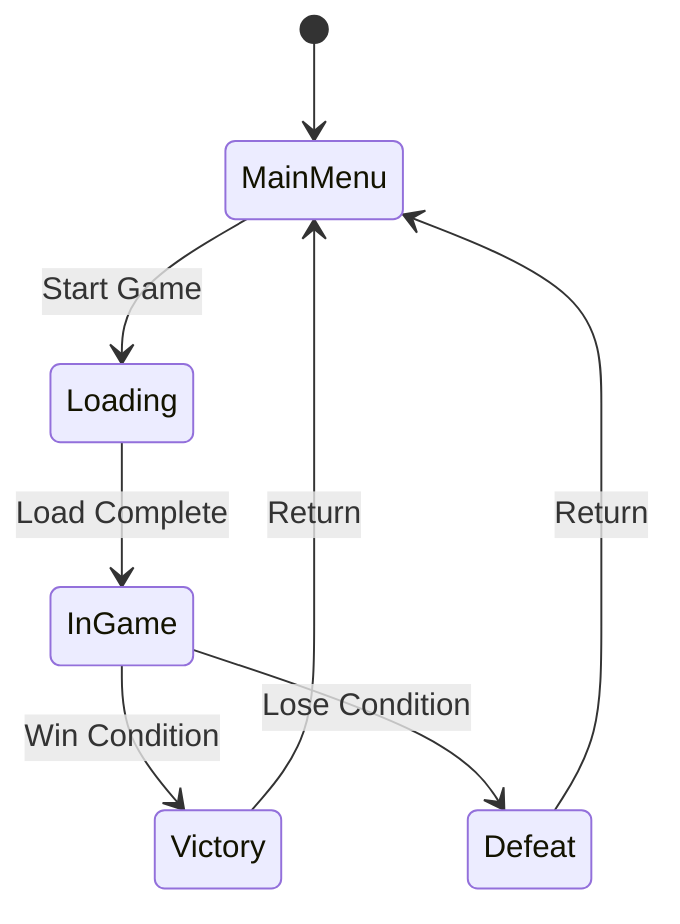
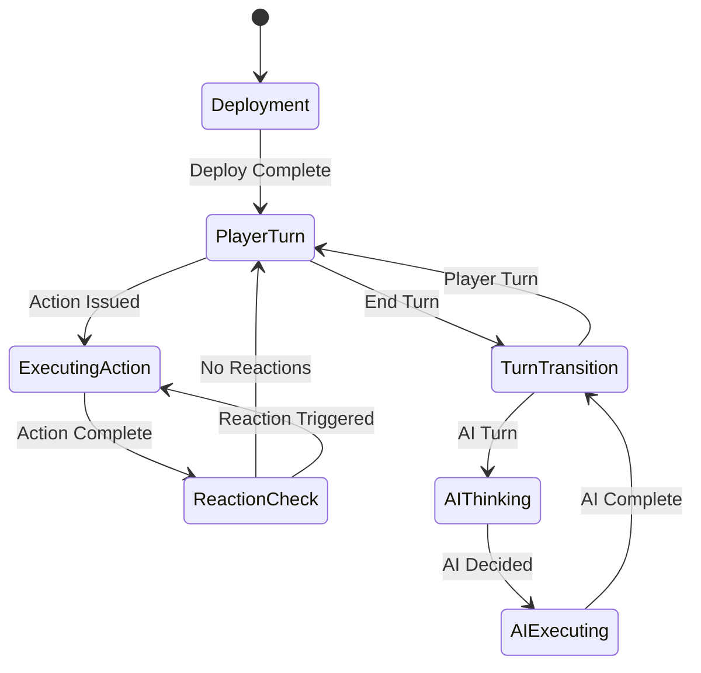

# ADR-023: Layered Game State Management

**Status**: Accepted
**Date**: 2025-09-17
**Decision Makers**: Tech Lead, Dev Engineer
**Tags**: `architecture` `state-management` `input` `turn-based`

## Context

Darklands is a turn-based tactical game that requires sophisticated state management for:
- **Input Control**: Preventing user actions during animations or AI turns
- **Turn Sequencing**: Managing player turns, AI turns, and action execution
- **UI Modality**: Handling overlapping UI states (dialogs, inventory, targeting)
- **Animation Coordination**: Blocking new actions while animations play
- **Save/Load**: Persisting game state across sessions
- **Future Features**: Replay systems, multiplayer, complex ability targeting

Initial attempts proposed simple boolean flags (`_isProcessingCommand`), but analysis revealed we need a more robust solution that can handle the complexity of a Battle Brothers-scale tactical game.

## Decision

Implement a **Layered State Management System** with three distinct layers:

1. **Core Layer**: Exclusive game flow states (MainMenu, InGame, GameOver)
2. **Gameplay Layer**: Context-specific substates (PlayerTurn, AITurn, ExecutingAction)
3. **UI Layer**: Stackable overlay states (Dialog, Inventory, Targeting)

### Architecture

```csharp
// Layer 1: Core game flow (mutually exclusive)
public enum GameFlowState
{
    MainMenu,
    Loading,
    InGame,     // Combat or exploration active
    Victory,
    Defeat,
    Credits
}

// Layer 2: Combat substates (only valid when InGame)
public enum CombatState
{
    Deployment,     // Initial unit placement
    PlayerTurn,     // Player can issue commands
    ExecutingAction,// Animation/effect playing
    AIThinking,     // AI calculating move
    AIExecuting,    // AI animation playing
    ReactionCheck,  // Checking for interrupts/reactions
    TurnTransition  // Between turns
}

// Layer 3: UI overlays (can stack)
public enum UIOverlay
{
    None,
    ModalDialog,    // Blocks all input
    Inventory,      // Partial input blocking
    TargetingMode,  // Special input mode
    PathPreview,    // Shows movement path
    ContextMenu,    // Right-click menu
    Tutorial        // Tutorial overlay
}
```

### Core Implementation

```csharp
public interface IGameStateManager
{
    // Layer queries
    GameFlowState CurrentFlowState { get; }
    CombatState? CurrentCombatState { get; }
    IReadOnlyCollection<UIOverlay> ActiveOverlays { get; }

    // State queries
    bool CanProcessPlayerInput();
    bool CanExecuteCombatAction();
    bool IsModalUIActive();

    // State transitions
    Fin<Unit> TransitionFlowState(GameFlowState newState);
    Fin<Unit> TransitionCombatState(CombatState newState);
    void PushOverlay(UIOverlay overlay);
    void PopOverlay(UIOverlay overlay);
}

public class LayeredGameStateManager : IGameStateManager
{
    private readonly IMediator _mediator;
    private readonly IUIEventBus _eventBus;
    private readonly ILogger<LayeredGameStateManager> _logger;

    private GameFlowState _flowState = GameFlowState.MainMenu;
    private CombatStateContext? _combatContext;
    private readonly Stack<UIOverlay> _overlayStack = new();

    // Validation rules
    private readonly Dictionary<(GameFlowState, GameFlowState), bool> _flowTransitions = new()
    {
        { (GameFlowState.MainMenu, GameFlowState.Loading), true },
        { (GameFlowState.Loading, GameFlowState.InGame), true },
        { (GameFlowState.InGame, GameFlowState.Victory), true },
        { (GameFlowState.InGame, GameFlowState.Defeat), true },
        // ... more rules
    };

    public bool CanProcessPlayerInput()
    {
        // Check UI layer first (highest priority)
        if (_overlayStack.Any(o => o == UIOverlay.ModalDialog))
            return false;

        // Check if in appropriate flow state
        if (_flowState != GameFlowState.InGame)
            return _flowState == GameFlowState.MainMenu;

        // Check combat state if in combat
        return _combatContext?.State switch
        {
            CombatState.PlayerTurn => true,
            CombatState.Deployment => true,
            CombatState.TargetingMode => true,
            _ => false
        };
    }

    public Fin<Unit> TransitionCombatState(CombatState newState)
    {
        if (_combatContext == null)
            return Fin<Unit>.Fail(new Error("Not in combat"));

        if (!_combatContext.CanTransitionTo(newState))
            return Fin<Unit>.Fail(new Error($"Invalid transition: {_combatContext.State} → {newState}"));

        var oldState = _combatContext.State;
        _combatContext.State = newState;

        // Publish event for subscribers
        _eventBus.Publish(new CombatStateChangedEvent(oldState, newState));

        // Handle state-specific logic
        HandleCombatStateEntry(newState);

        return Fin<Unit>.Succ(Unit.Default);
    }

    private void HandleCombatStateEntry(CombatState state)
    {
        switch (state)
        {
            case CombatState.AIThinking:
                // Start AI calculation
                _mediator.Send(new CalculateAITurnCommand());
                break;

            case CombatState.ExecutingAction:
                // Animation system will transition back when complete
                break;

            case CombatState.TurnTransition:
                // Process end-of-turn effects
                _mediator.Send(new ProcessTurnEndCommand());
                break;
        }
    }
}
```

### Integration with Existing Systems

#### With Logical-Visual Position Separation (ADR-022)
```csharp
public class MoveActorCommandHandler
{
    public async Task<Fin<Unit>> Handle(MoveActorCommand command)
    {
        // Check if we can execute
        if (!_stateManager.CanExecuteCombatAction())
            return Fin<Unit>.Fail(new Error("Cannot act in current state"));

        // Transition to executing
        _stateManager.TransitionCombatState(CombatState.ExecutingAction);

        // Start movement (instant game position)
        actor.MoveTo(command.Destination);

        // Start FOV progression (revealed position)
        _fogRevealService.StartRevealProgression(actor.Id, command.Path);

        // Animation complete will transition back to PlayerTurn
        return Fin<Unit>.Succ(Unit.Default);
    }
}
```

#### With UI Event Bus (ADR-010)
```csharp
public class CombatPresenter : EventAwarePresenter
{
    protected override void OnNotification(INotification notification)
    {
        switch (notification)
        {
            case CombatStateChangedEvent evt:
                UpdateUIForState(evt.NewState);
                break;

            case UIOverlayPushedEvent evt:
                HandleOverlayActivation(evt.Overlay);
                break;
        }
    }

    private void UpdateUIForState(CombatState state)
    {
        _view.SetEndTurnButtonEnabled(state == CombatState.PlayerTurn);
        _view.SetCursor(state == CombatState.TargetingMode ? "crosshair" : "default");
    }
}
```

## Consequences

### Positive

- **Clear Input Control**: Single source of truth for "can I act now?"
- **Extensible**: Easy to add new states and layers
- **Testable**: State transitions can be unit tested without UI
- **Save-Friendly**: State enums serialize easily
- **Deterministic**: Validated transitions ensure predictable behavior
- **Debugging**: Clear state visibility for troubleshooting
- **UI Coordination**: Overlay stack handles modal dialogs properly
- **Future-Proof**: Supports replay, multiplayer state sync, complex abilities

### Negative

- **Complexity**: Three layers to understand and coordinate
- **Validation Rules**: Must maintain transition validation matrices
- **State Explosion**: Possible proliferation of substates
- **Learning Curve**: Developers must understand layered approach

### Mitigations

- **Documentation**: Clear state diagrams and transition rules
- **Validation Tests**: Comprehensive tests for all transitions
- **Debug Tools**: State viewer in development builds
- **Conventions**: Consistent naming and organization

## Alternatives Considered

### Alternative 1: Simple Boolean Flags
```csharp
private bool _isProcessingCommand = false;
private bool _isAITurn = false;
private bool _isDialogOpen = false;
```
- **Rejected**: Becomes unmaintainable with multiple states, no validation

### Alternative 2: Single Flat State Machine
All states in one enum (MainMenu, PlayerTurn, PlayerTurnWithInventory, etc.)
- **Rejected**: Combinatorial explosion, can't handle overlapping states

### Alternative 3: Full Hierarchical State Machine Framework
Using a library like Stateless or custom HSM with full entry/exit/guard support.
- **Rejected**: Over-engineering for our needs, adds dependency

### Alternative 4: Event-Sourced State
Track state as series of events, compute current state from event log.
- **Rejected**: Overcomplicated for game state, performance concerns

## Implementation Plan

### Phase 1: Core Infrastructure (2h)
1. Create IGameStateManager interface
2. Implement LayeredGameStateManager
3. Add validation rules for transitions
4. Create state change events

### Phase 2: Combat Integration (2h)
1. Create CombatStateContext
2. Integrate with turn management
3. Add combat state transitions
4. Update command handlers

### Phase 3: UI Layer (1h)
1. Implement overlay stack
2. Add push/pop operations
3. Integrate with modal dialogs
4. Update presenters

### Phase 4: Testing (1h)
1. Unit tests for transitions
2. Integration tests with commands
3. UI tests for input blocking
4. Save/load tests

## State Transition Rules

### Flow State Transitions


### Combat State Transitions


## Related Decisions

- **ADR-004**: Deterministic Simulation - State transitions must be deterministic
- **ADR-005**: Save-Ready Architecture - State enums serialize easily
- **ADR-010**: UI Event Bus - State changes published as events
- **ADR-022**: Logical-Visual Position Separation - ExecutingAction state during animations
- **ADR-006**: Selective Abstraction - State management is abstracted
- **ADR-009**: Sequential Turn Processing - Aligns with turn states

## Future Extensions

### Planned Enhancements
1. **State History**: Track last N states for undo support
2. **State Persistence**: Save/load mid-combat
3. **Replay System**: Record state transitions for replay
4. **Multiplayer Sync**: Synchronize state across network
5. **Complex Abilities**: Multi-step targeting states

### Extensibility Points
- New flow states: Add to GameFlowState enum
- New combat states: Add to CombatState enum
- New overlays: Add to UIOverlay enum
- Custom validation: Override transition rules
- State-specific data: Add to context objects

## Notes

This pattern is common in tactical games:
- **XCOM**: Uses similar layered states for tactical/strategy layers
- **Divinity Original Sin**: Stacks UI states over combat states
- **Battle Brothers**: Has deployment/combat/camp states

The key insight is that game state is not monolithic - it's naturally layered, with each layer having different scope and rules.

## References

- Game Programming Patterns - State Pattern
- Unity's Playmaker (hierarchical state machines)
- Original proposal: TD_063 in Backlog.md