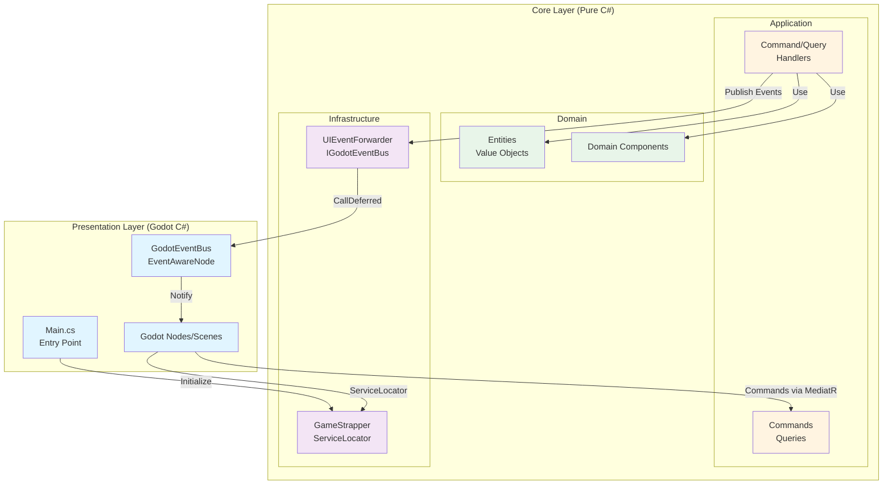
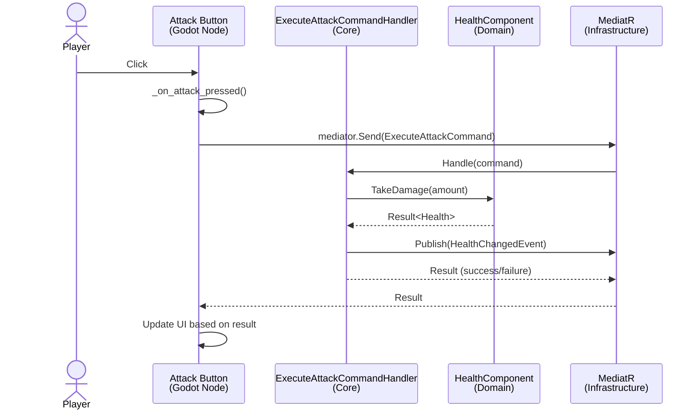
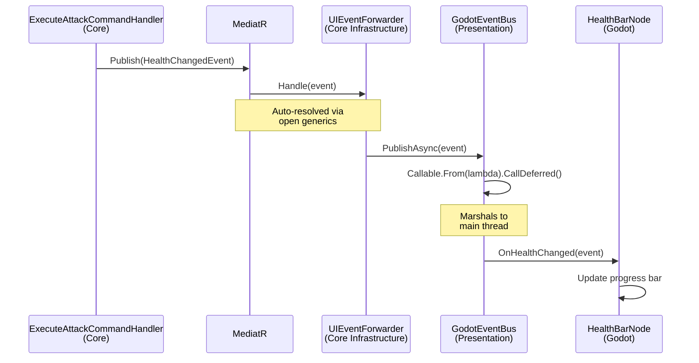
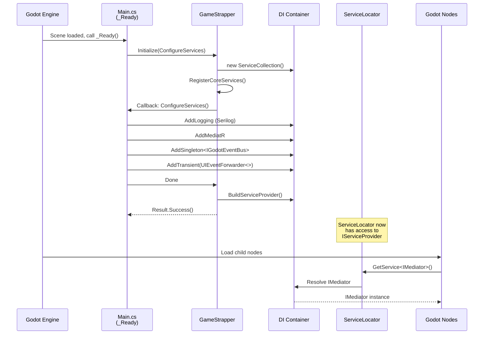
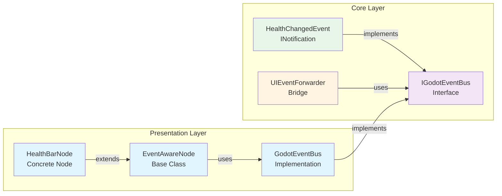
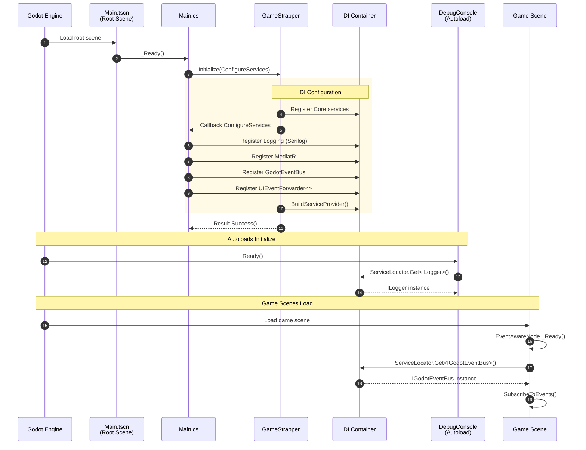

# Darklands Architecture Overview

**Status**: Living Document
**Last Updated**: 2025-09-30
**Purpose**: High-level architectural overview with control flow examples

This document explains how Darklands' architecture works at a glance. For detailed rationale, see the ADR documents.

---

## 🏗️ Three-Layer Architecture

Darklands uses **Clean Architecture** with strict separation between game logic and Godot framework.



**Key Principle**: Core layer has ZERO Godot dependencies (enforced at compile-time).

---

## 📁 Project Structure

```
darklands/
├── src/Darklands.Core/              ← Pure C# (Microsoft.NET.Sdk)
│   ├── Domain/                      ← Business entities, value objects
│   │   └── Events/                  ← Domain events (INotification)
│   ├── Application/                 ← Commands, queries, handlers
│   │   └── Infrastructure/          ← GameStrapper (DI bootstrap)
│   └── Infrastructure/              ← Services, interfaces
│       ├── DependencyInjection/     ← ServiceLocator
│       └── Events/                  ← IGodotEventBus, UIEventForwarder
│
├── Darklands.csproj                 ← Godot project (Godot.NET.Sdk)
│   ├── Main.cs                      ← Entry point, DI configuration
│   ├── Components/                  ← Reusable Godot nodes
│   │   └── EventAwareNode.cs        ← Base class for event-aware nodes
│   ├── Infrastructure/              ← Godot-specific implementations
│   │   ├── Events/                  ← GodotEventBus
│   │   └── Logging/                 ← Serilog sinks
│   ├── TestScenes/                  ← Manual test scenes
│   └── *.tscn                       ← Godot scene files
│
└── tests/Darklands.Core.Tests/      ← Unit/integration tests
```

**Dependencies**:
- ✅ Presentation → Core (one-way)
- ❌ Core → Presentation (forbidden)

---

## 🔄 Control Flow Patterns

### Pattern 1: User Action → Business Logic (Godot → Core)

**Example**: Player clicks "Attack" button



**Code Flow**:
```csharp
// 1. Godot Button (Presentation)
public partial class AttackButton : Button
{
    private IMediator _mediator;

    public override void _Ready()
    {
        // ServiceLocator ONLY at Godot boundary
        _mediator = ServiceLocator.Get<IMediator>();
        Pressed += OnAttackPressed;
    }

    private async void OnAttackPressed()
    {
        // Send command to Core
        var result = await _mediator.Send(new ExecuteAttackCommand(
            AttackerId: _playerActorId,
            TargetId: _selectedEnemyId
        ));

        // Handle result in UI
        if (result.IsFailure)
            ShowError(result.Error);
    }
}

// 2. Command Handler (Core Application Layer)
public class ExecuteAttackCommandHandler
    : IRequestHandler<ExecuteAttackCommand, Result>
{
    private readonly IComponentRegistry _components;
    private readonly IMediator _mediator;
    private readonly ILogger<ExecuteAttackCommandHandler> _logger;

    // Constructor injection (NOT ServiceLocator)
    public ExecuteAttackCommandHandler(
        IComponentRegistry components,
        IMediator mediator,
        ILogger<ExecuteAttackCommandHandler> logger)
    {
        _components = components;
        _mediator = mediator;
        _logger = logger;
    }

    public async Task<Result> Handle(
        ExecuteAttackCommand cmd,
        CancellationToken ct)
    {
        // Get domain component
        var targetHealth = _components.GetComponent<IHealthComponent>(cmd.TargetId);
        if (targetHealth.IsFailure)
            return targetHealth.ConvertFailure();

        // Execute business logic
        var damageResult = targetHealth.Value.TakeDamage(cmd.Damage);
        if (damageResult.IsFailure)
            return damageResult.ConvertFailure();

        _logger.LogInformation("Attack executed: {Damage} damage to {Target}",
            cmd.Damage, cmd.TargetId);

        // Publish domain event (will route to Godot UI via EventBus)
        await _mediator.Publish(new HealthChangedEvent(
            cmd.TargetId,
            damageResult.Value
        ), ct);

        return Result.Success();
    }
}

// 3. Domain Logic (Core Domain Layer)
public class HealthComponent : IHealthComponent
{
    public Health CurrentHealth { get; private set; }

    public Result<Health> TakeDamage(float amount)
    {
        // Pure business logic, no framework dependencies
        return CurrentHealth.Reduce(amount)
            .Tap(newHealth => CurrentHealth = newHealth);
    }
}
```

---

### Pattern 2: State Change → UI Update (Core → Godot)

**Example**: Health changes → Update health bar



**Code Flow**:
```csharp
// 1. Command Handler publishes event (Core)
public async Task<Result> Handle(ExecuteAttackCommand cmd, CancellationToken ct)
{
    // ... business logic ...

    // Publish domain event
    await _mediator.Publish(new HealthChangedEvent(
        ActorId: cmd.TargetId,
        NewHealth: damageResult.Value,
        IsCritical: damageResult.Value.Percentage < 0.25f
    ), ct);

    return Result.Success();
}

// 2. UIEventForwarder bridges MediatR → GodotEventBus (Core Infrastructure)
// NOTE: Auto-registered via open generics, no manual registration needed!
public class UIEventForwarder<TEvent> : INotificationHandler<TEvent>
    where TEvent : INotification
{
    private readonly IGodotEventBus _eventBus;

    public Task Handle(TEvent notification, CancellationToken ct)
    {
        // Forward to GodotEventBus for routing to Godot nodes
        return _eventBus.PublishAsync(notification);
    }
}

// 3. GodotEventBus marshals to main thread (Presentation Infrastructure)
public class GodotEventBus : IGodotEventBus
{
    public Task PublishAsync<TEvent>(TEvent eventData) where TEvent : INotification
    {
        // Get all subscribers for this event type
        foreach (var (subscriber, handler) in _subscriptions[typeof(TEvent)])
        {
            // Marshal to Godot main thread via CallDeferred
            Callable.From(() =>
            {
                try
                {
                    ((Action<TEvent>)handler)(eventData);
                }
                catch (Exception ex)
                {
                    _logger.LogError(ex, "Error in subscriber {Subscriber}",
                        subscriber.GetType().Name);
                }
            }).CallDeferred();
        }

        return Task.CompletedTask;
    }
}

// 4. HealthBarNode receives event (Presentation)
public partial class HealthBarNode : EventAwareNode
{
    private ProgressBar _healthBar;

    protected override void SubscribeToEvents()
    {
        // Subscribe to domain events
        EventBus.Subscribe<HealthChangedEvent>(this, OnHealthChanged);
    }

    private void OnHealthChanged(HealthChangedEvent evt)
    {
        // Update UI on main thread (CallDeferred guarantees this)
        _healthBar.Value = evt.NewHealth.Percentage * 100;

        if (evt.IsCritical)
        {
            _healthBar.Modulate = Colors.Red; // Flash red when low
        }
    }

    public override void _ExitTree()
    {
        // Automatic cleanup (prevents memory leaks)
        EventBus?.UnsubscribeAll(this);
        base._ExitTree();
    }
}
```

---

## 🔌 Dependency Injection

### Initialization Flow



**Key Points**:
- ✅ DI initialized ONCE in Main._Ready()
- ✅ GameStrapper stores IServiceProvider (thread-safe singleton)
- ✅ ServiceLocator bridges Godot → DI (only at boundary)
- ✅ Core uses constructor injection (testable, explicit)

### ServiceLocator Usage Pattern

```csharp
// ✅ CORRECT: Use in Godot node _Ready() methods
public partial class HealthBarNode : EventAwareNode
{
    private ILogger<HealthBarNode> _logger;

    public override void _Ready()
    {
        base._Ready();

        // ServiceLocator at Godot boundary (unavoidable)
        _logger = ServiceLocator.Get<ILogger<HealthBarNode>>();
    }
}

// ❌ WRONG: Use in Core layer
public class ExecuteAttackCommandHandler
{
    public Task<Result> Handle(ExecuteAttackCommand cmd)
    {
        // ❌ NEVER DO THIS - hides dependencies!
        var logger = ServiceLocator.Get<ILogger>();
    }
}

// ✅ CORRECT: Constructor injection in Core
public class ExecuteAttackCommandHandler
{
    private readonly ILogger<ExecuteAttackCommandHandler> _logger;

    public ExecuteAttackCommandHandler(ILogger<ExecuteAttackCommandHandler> logger)
    {
        _logger = logger; // Explicit dependency
    }
}
```

---

## 🎯 Event Bus Architecture

### Why EventBus Instead of Godot Signals?

**Use Godot Signals for**:
- ✅ Parent-child UI communication
- ✅ Button clicks, animations
- ✅ Scene-local events

**Use EventBus for**:
- ✅ Domain events affecting multiple systems
- ✅ Cross-system state synchronization
- ✅ Events originating from Core logic

### EventBus Components



**Thread Safety**: GodotEventBus uses `Callable.CallDeferred()` to marshal events from any thread to Godot's main thread.

---

## 📦 Package Dependencies

### Core Project (Pure C#)
```xml
<PackageReference Include="CSharpFunctionalExtensions" Version="2.42.5" />
<PackageReference Include="MediatR" Version="12.4.1" />
<PackageReference Include="Microsoft.Extensions.Logging.Abstractions" Version="9.0.0" />
<PackageReference Include="Microsoft.Extensions.DependencyInjection" Version="9.0.0" />
```

**No Godot packages** (enforced by `Microsoft.NET.Sdk`)

### Presentation Project (Godot)
```xml
<PackageReference Include="Godot.SourceGenerators" Version="4.4.0" />
<PackageReference Include="GodotSharp" Version="4.4.0" />
<PackageReference Include="Serilog" Version="4.2.0" />
<PackageReference Include="Serilog.Extensions.Logging" Version="8.0.0" />
<PackageReference Include="Serilog.Sinks.Console" Version="6.0.0" />
<PackageReference Include="Serilog.Sinks.File" Version="6.0.0" />
```

Plus references Core project:
```xml
<ProjectReference Include="src\Darklands.Core\Darklands.Core.csproj" />
```

---

## 🧪 Testing Strategy

### Unit Tests (Fast)
```csharp
// Test Core logic without Godot
[Fact]
public void TakeDamage_ShouldReduceHealth()
{
    // Arrange
    var health = new Health(Current: 100, Maximum: 100);

    // Act
    var result = health.Reduce(30);

    // Assert
    result.IsSuccess.Should().BeTrue();
    result.Value.Current.Should().Be(70);
}
```

### Integration Tests (Medium)
```csharp
// Test MediatR → EventBus flow without Godot runtime
[Fact]
public async Task MediatR_ShouldForwardToGodotEventBus()
{
    // Arrange
    var services = new ServiceCollection();
    services.AddMediatR(cfg => cfg.RegisterServicesFromAssembly(typeof(IMediator).Assembly));
    services.AddSingleton<IGodotEventBus>(mockEventBus);
    services.AddTransient(typeof(INotificationHandler<>), typeof(UIEventForwarder<>));

    var provider = services.BuildServiceProvider();
    var mediator = provider.GetRequiredService<IMediator>();

    // Act
    await mediator.Publish(new TestEvent("message"));

    // Assert
    await mockEventBus.Received(1).PublishAsync(Arg.Any<TestEvent>());
}
```

### Manual Tests (Slow)
- Run Godot scenes in TestScenes/
- Verify UI updates, CallDeferred threading
- Test node lifecycle (subscribe/unsubscribe)

---

## 🚀 Startup Sequence



**Critical**: Main.cs initializes DI BEFORE any other nodes need services.

---

## 📚 Related Documentation

- [ADR-001: Clean Architecture Foundation](./ADR/ADR-001-clean-architecture-foundation.md) - Why this architecture?
- [ADR-002: Godot Integration Architecture](./ADR/ADR-002-godot-integration-architecture.md) - How Core connects to Godot
- [ADR-003: Functional Error Handling](./ADR/ADR-003-functional-error-handling.md) - Result<T> pattern

---

## ❓ Common Questions

### Q: Why ServiceLocator if it's an anti-pattern?

**A**: ServiceLocator is ONLY used at the Godot boundary (in `_Ready()` methods). This is pragmatic because:
- Godot instantiates nodes via scene loading (can't use constructor injection)
- Core layer uses constructor injection (testable, explicit dependencies)
- Isolated to Presentation layer (doesn't pollute business logic)

See [ADR-002](./ADR/ADR-002-godot-integration-architecture.md) for full rationale.

### Q: Why not just use Godot Signals everywhere?

**A**: Godot Signals are great for UI, but domain events need to:
- Originate from Core layer (which can't reference Godot)
- Be testable without Godot runtime
- Flow from business logic to multiple unrelated UI systems

EventBus bridges Core domain events → Godot UI updates.

### Q: Can I bypass the architecture "just this once"?

**A**: NO. Architecture enforcement is compile-time:
- Core.csproj uses `Microsoft.NET.Sdk` (not Godot SDK)
- Any `using Godot;` in Core → compilation error
- Tests validate DI registration, event flow, etc.

If you need Godot features, put code in Presentation layer.

### Q: How do I add a new command/event?

**Quick Reference**:

1. **Command** (Core/Application/Commands/):
   ```csharp
   public record MyCommand(int Arg1) : IRequest<Result>;
   ```

2. **Handler** (Core/Application/Commands/):
   ```csharp
   public class MyCommandHandler : IRequestHandler<MyCommand, Result>
   {
       public Task<Result> Handle(MyCommand cmd, CancellationToken ct) { ... }
   }
   ```

3. **Event** (Core/Domain/Events/):
   ```csharp
   public record MyEvent(int Data) : INotification;
   ```

4. **UI Subscriber** (Presentation/):
   ```csharp
   public partial class MyNode : EventAwareNode
   {
       protected override void SubscribeToEvents()
       {
           EventBus.Subscribe<MyEvent>(this, OnMyEvent);
       }
   }
   ```

**No registration needed** - MediatR and EventBus auto-resolve via open generics!

---

**Maintained By**: Tech Lead
**Review Cycle**: Update when architecture changes (new patterns, significant refactors)