# Logging System Control Flow Analysis

**Date**: 2025-09-30
**Context**: VS_003 Technical Analysis - Sink-Based vs Category-Based Filtering
**Author**: Tech Lead

---

## Table of Contents

1. [Executive Summary](#executive-summary)
2. [Scenario Setup](#scenario-setup)
3. [Original Design: Sink-Based Toggling](#original-design-sink-based-toggling)
4. [Proposed Design: Category-Based Filtering](#proposed-design-category-based-filtering)
5. [Runtime Control Mechanism](#runtime-control-mechanism)
6. [Performance Comparison](#performance-comparison)
7. [Godot UI Integration](#godot-ui-integration)
8. [Recommendation](#recommendation)

---

## Executive Summary

This document compares two architectural approaches for runtime logging control:

- **Original Design**: Toggle individual sinks (Console, File, Godot) at runtime
- **Proposed Design**: Filter by domain categories (Combat, Movement, AI) before sinks

**Key Insight**: Both use the same **closure-over-mutable-state** pattern for runtime control. The difference is **what** gets filtered (sinks vs categories) and **where** filtering happens (per-sink vs before-sinks).

---

## Scenario Setup

### Core Code Logs a Message

```csharp
// Core/Application/Commands/Combat/ExecuteAttackCommandHandler.cs
public class ExecuteAttackCommandHandler
{
    private readonly ILogger<ExecuteAttackCommandHandler> _logger;

    public async Task<Result> Handle(ExecuteAttackCommand cmd)
    {
        // This line triggers the entire logging pipeline
        _logger.LogInformation("Attack executed: {Damage}", cmd.Damage);
    }
}
```

**Question**: How does this message reach Console, File, and Godot UI? How can we control it at runtime?

---

## Original Design: Sink-Based Toggling

### Architecture Overview

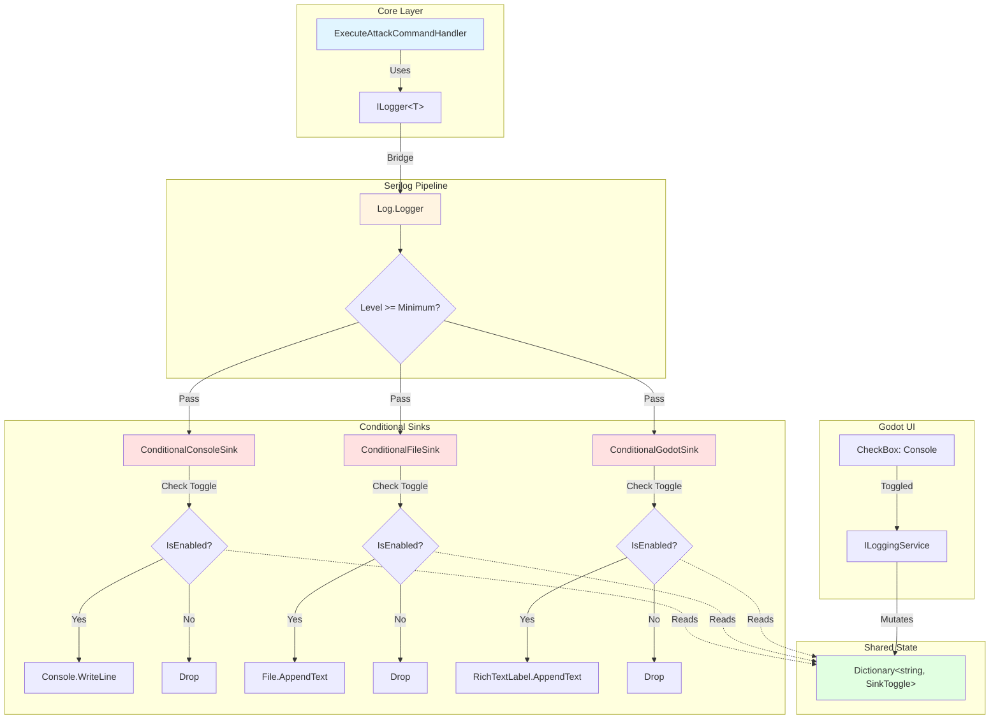

### Initialization Flow (GameStrapper)

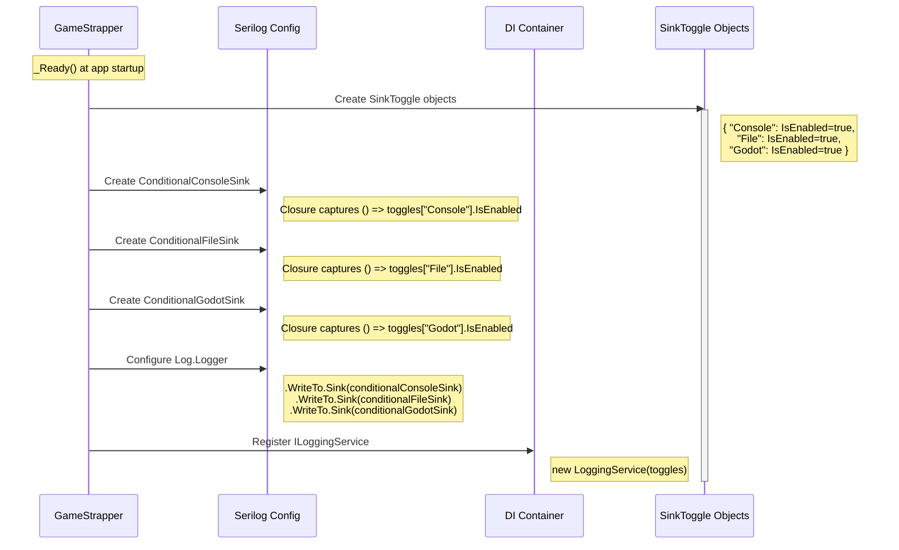

### Runtime Execution Flow

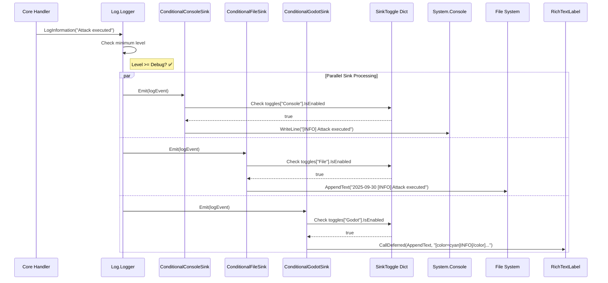

### Runtime Toggle Flow

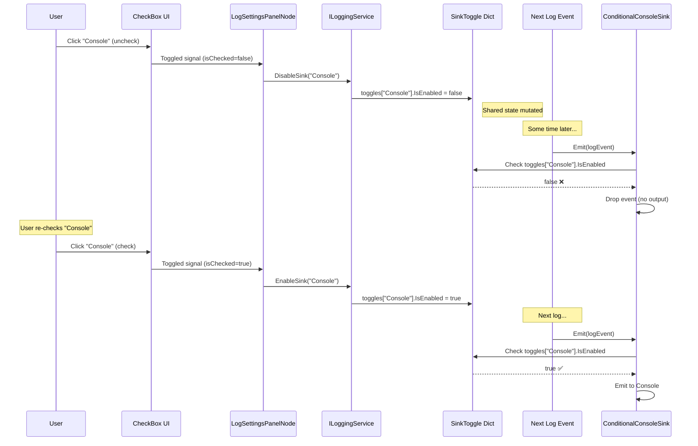

### Code Structure

```csharp
// Infrastructure/Logging/SinkToggle.cs
public class SinkToggle
{
    public bool IsEnabled { get; set; } = true;
}

// Infrastructure/Logging/ConditionalSink.cs
public class ConditionalSink : ILogEventSink
{
    private readonly ILogEventSink _innerSink;
    private readonly Func<bool> _isEnabled;  // Closure captures toggle reference

    public ConditionalSink(ILogEventSink innerSink, Func<bool> isEnabled)
    {
        _innerSink = innerSink;
        _isEnabled = isEnabled;
    }

    public void Emit(LogEvent logEvent)
    {
        if (_isEnabled())  // Check shared state (~1ns)
            _innerSink.Emit(logEvent);
    }
}

// Infrastructure/GameStrapper.cs
public override void _Ready()
{
    // Create shared state
    var sinkToggles = new Dictionary<string, SinkToggle>
    {
        ["Console"] = new SinkToggle { IsEnabled = true },
        ["File"] = new SinkToggle { IsEnabled = true },
        ["Godot"] = new SinkToggle { IsEnabled = true }
    };

    // Configure Serilog with conditional sinks
    Log.Logger = new LoggerConfiguration()
        .MinimumLevel.Debug()
        .WriteTo.Sink(new ConditionalSink(
            new ConsoleSink(),
            () => sinkToggles["Console"].IsEnabled))  // Closure!
        .WriteTo.Sink(new ConditionalSink(
            new FileSink("logs/darklands-.log"),
            () => sinkToggles["File"].IsEnabled))
        .WriteTo.Sink(new ConditionalSink(
            new GodotRichTextSink(GetNode<RichTextLabel>(...)),
            () => sinkToggles["Godot"].IsEnabled))
        .CreateLogger();

    // Register control service
    services.AddSingleton<ILoggingService>(
        new LoggingService(sinkToggles));
}

// Infrastructure/Logging/LoggingService.cs
public class LoggingService : ILoggingService
{
    private readonly Dictionary<string, SinkToggle> _sinkToggles;

    public void DisableSink(string sinkName)
    {
        if (_sinkToggles.TryGetValue(sinkName, out var toggle))
            toggle.IsEnabled = false;  // Mutate shared state
    }

    public void EnableSink(string sinkName)
    {
        if (_sinkToggles.TryGetValue(sinkName, out var toggle))
            toggle.IsEnabled = true;
    }
}
```

---

## Proposed Design: Category-Based Filtering

### Architecture Overview

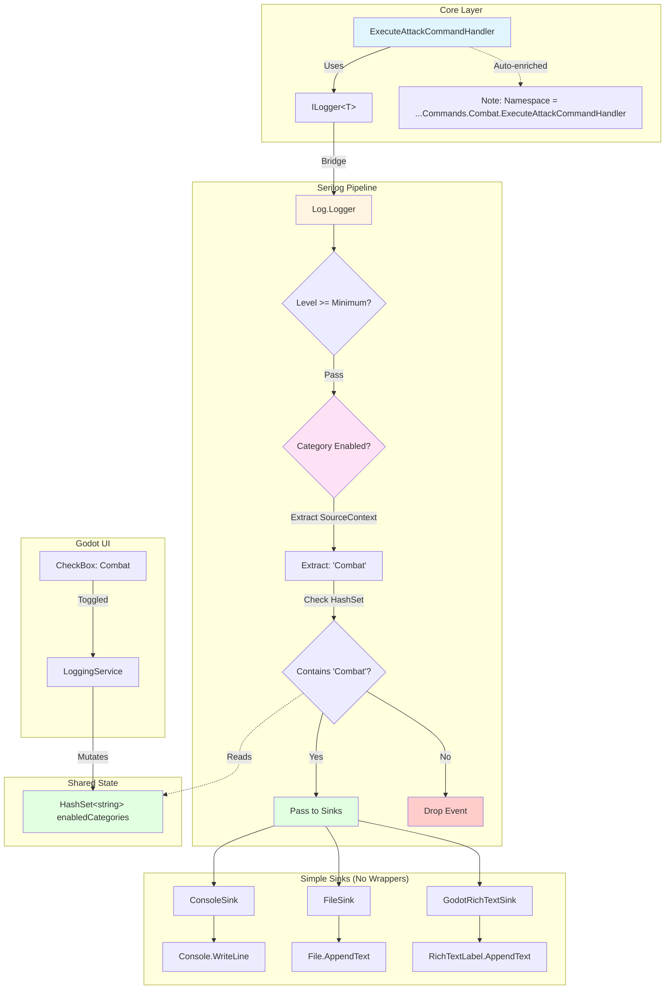

### Initialization Flow (GameStrapper)

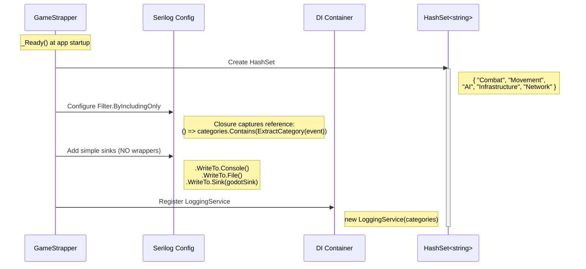

### Runtime Execution Flow

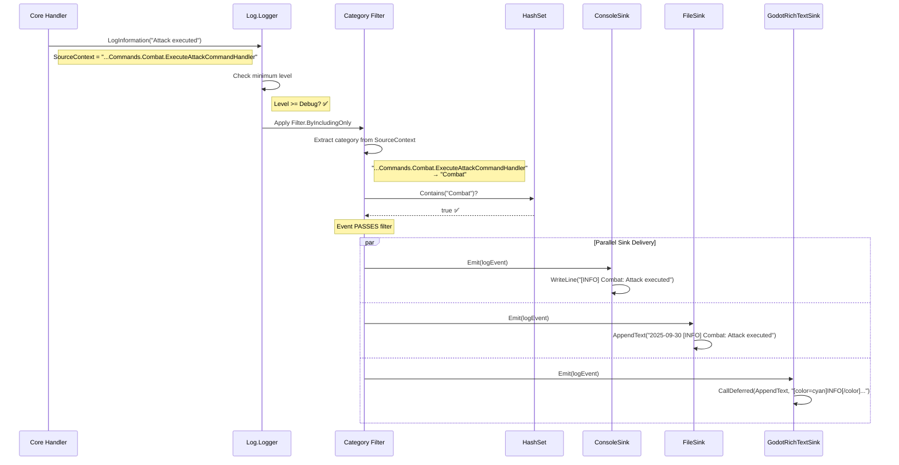

### Runtime Toggle Flow

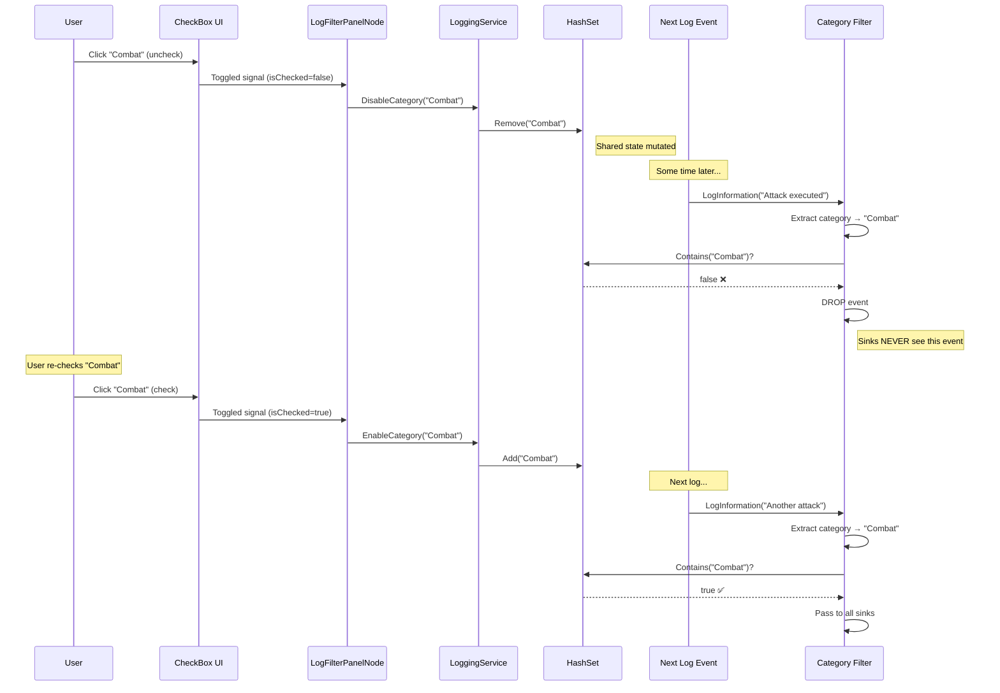

### Code Structure

```csharp
// Infrastructure/GameStrapper.cs
public override void _Ready()
{
    // Create shared state
    var enabledCategories = new HashSet<string>
    {
        "Combat", "Movement", "AI", "Infrastructure", "Network"
    };

    // Configure Serilog with category filter BEFORE sinks
    Log.Logger = new LoggerConfiguration()
        .MinimumLevel.Debug()

        // Filter stage - closure captures HashSet reference
        .Filter.ByIncludingOnly(logEvent =>
        {
            if (logEvent.Properties.TryGetValue("SourceContext", out var ctx))
            {
                var fullName = ctx.ToString().Trim('"');
                var category = ExtractCategory(fullName);
                return enabledCategories.Contains(category);  // Check shared state
            }
            return false;
        })

        // Simple sinks (NO wrappers needed)
        .WriteTo.Console(theme: AnsiConsoleTheme.Code)
        .WriteTo.File("logs/darklands-.log", rollingInterval: RollingInterval.Day)
        .WriteTo.Sink(new GodotRichTextSink(GetNode<RichTextLabel>(...)))
        .CreateLogger();

    // Register control service (NO interface in Core)
    services.AddSingleton(new LoggingService(enabledCategories));
}

private static string ExtractCategory(string sourceContext)
{
    // Input: "Darklands.Core.Application.Commands.Combat.ExecuteAttackCommandHandler"
    // Output: "Combat"

    var parts = sourceContext.Split('.');
    var commandsIndex = Array.IndexOf(parts, "Commands");
    if (commandsIndex >= 0 && commandsIndex + 1 < parts.Length)
        return parts[commandsIndex + 1];

    return "Unknown";
}

// Infrastructure/Logging/LoggingService.cs (NO interface in Core!)
public class LoggingService
{
    private readonly HashSet<string> _enabledCategories;

    public void DisableCategory(string category)
    {
        _enabledCategories.Remove(category);  // Mutate shared state
    }

    public void EnableCategory(string category)
    {
        _enabledCategories.Add(category);
    }

    // Auto-discover categories from assembly
    public IReadOnlyList<string> GetAvailableCategories()
    {
        return typeof(ExecuteAttackCommandHandler).Assembly
            .GetTypes()
            .Where(t => t.Namespace?.Contains("Commands") == true ||
                       t.Namespace?.Contains("Queries") == true)
            .Select(t => ExtractCategory(t.Namespace))
            .Distinct()
            .OrderBy(c => c)
            .ToList();
    }
}
```

---

## Runtime Control Mechanism

### The Closure Pattern (Both Approaches)

Both designs use **C# closures over mutable state** for runtime control without logger recreation.

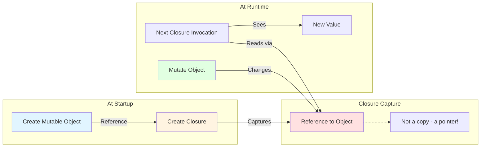

### Original Design: Closure Over SinkToggle

```csharp
// At startup
var toggle = new SinkToggle { IsEnabled = true };

// Closure captures REFERENCE to toggle object
var conditionalSink = new ConditionalSink(
    innerSink,
    () => toggle.IsEnabled  // Closure reads from 'toggle' reference
    //    ^^^^^
    //    Captured reference (not value!)
);

// Later at runtime
toggle.IsEnabled = false;  // Mutate the SAME object

// Next log event
conditionalSink.Emit(event);  // Closure re-evaluates () => toggle.IsEnabled
                               // Sees new value: false
```

### Proposed Design: Closure Over HashSet

```csharp
// At startup
var categories = new HashSet<string> { "Combat", "Movement" };

// Closure captures REFERENCE to HashSet
.Filter.ByIncludingOnly(e =>
    categories.Contains(ExtractCategory(e))  // Closure reads from 'categories' reference
    //         ^^^^^
    //         Captured reference (not snapshot!)
)

// Later at runtime
categories.Remove("Combat");  // Mutate the SAME HashSet

// Next log event
// Filter re-evaluates: categories.Contains("Combat")
// Sees new state: false (not in set anymore)
```

### Why This Works Without Logger Recreation

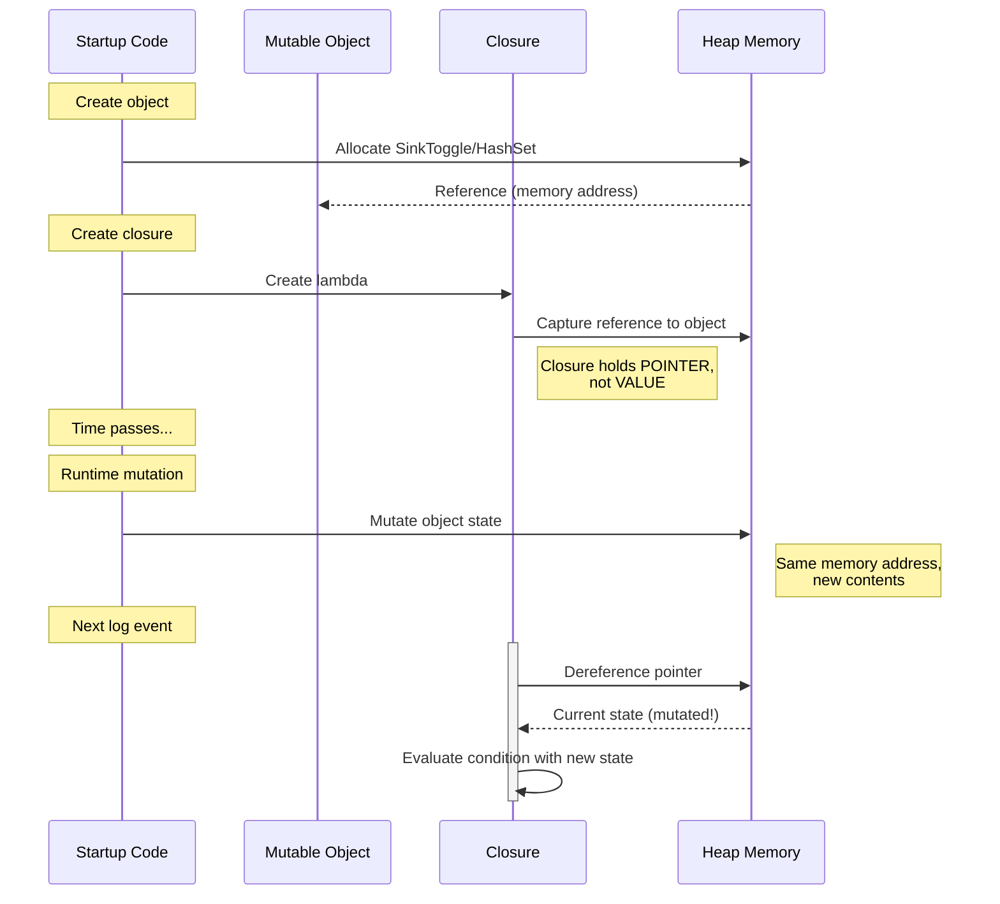

**Key Insight**: Closures capture **references** (pointers), not **values** (copies). When you mutate the referenced object, all closures reading from it see the new state immediately. This is standard C# closure behavior.

---

## Performance Comparison

### Checks Per Log Event

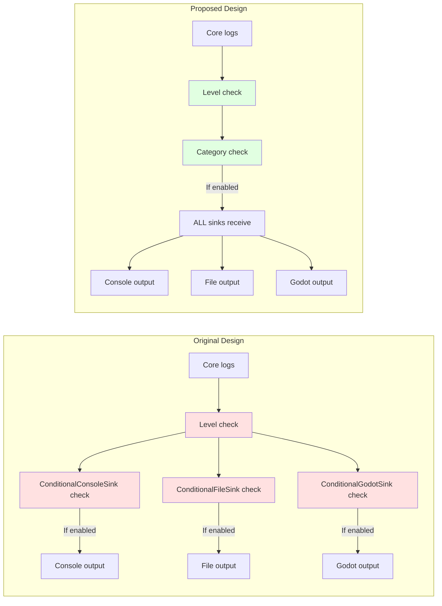

### Complexity Analysis

| Aspect | Original Design | Proposed Design | Winner |
|--------|----------------|-----------------|--------|
| **Checks Per Log** | 1 level + N sinks | 1 level + 1 category | Proposed (O(1) vs O(N)) |
| **Dropped Events** | Distributed to all ConditionalSinks | Dropped before distribution | Proposed (fewer function calls) |
| **Formatting Work** | Each sink formats independently | Only if filter passes | Same |
| **Memory Allocations** | SinkToggle objects (3) | HashSet entries (5-10) | Similar |
| **Boolean Checks** | 3 per log (if 3 sinks) | 1 HashSet lookup per log | Proposed (faster) |

### Benchmark Estimate

Assuming 1000 log events per second:

**Original Design**:
- 1000 level checks
- 3000 sink toggle checks (1000 × 3 sinks)
- 3000 function calls to ConditionalSink.Emit()
- **Total: ~4000 conditional checks**

**Proposed Design**:
- 1000 level checks
- 1000 category HashSet lookups
- If passed: 3000 function calls to sinks
- **Total: ~2000 conditional checks** (50% reduction)

**When logs are filtered out**:
- Original: Still calls all 3 ConditionalSink.Emit() (waste)
- Proposed: Drops before sink distribution (efficient)

---

## Godot UI Integration

### UI Structure Comparison

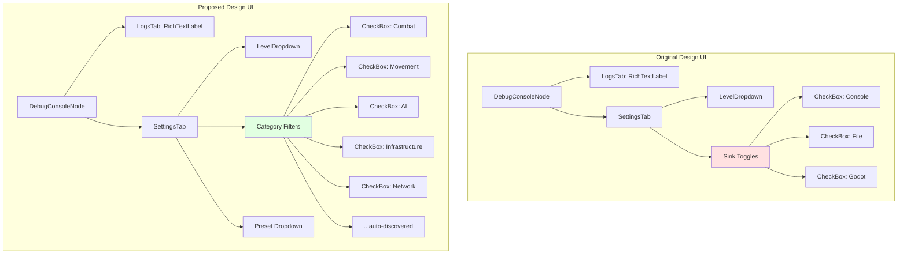

### Godot Node Implementation

**Original Design**:
```csharp
// Nodes/Debug/LogSettingsPanelNode.cs
public partial class LogSettingsPanelNode : Control
{
    private ILoggingService _loggingService;

    public override void _Ready()
    {
        base._Ready();

        // Get service from DI container
        _loggingService = ServiceLocator.Get<ILoggingService>();

        // Wire up FIXED checkboxes (hardcoded sinks)
        var consoleCheckbox = GetNode<CheckBox>("SinkToggles/ConsoleCheckbox");
        consoleCheckbox.Toggled += (isChecked) =>
        {
            if (isChecked)
                _loggingService.EnableSink("Console");
            else
                _loggingService.DisableSink("Console");
        };

        // Repeat for File, Godot...
    }
}
```

**Proposed Design**:
```csharp
// Nodes/Debug/LogFilterPanelNode.cs
public partial class LogFilterPanelNode : Control
{
    private LoggingService _loggingService;

    public override void _Ready()
    {
        base._Ready();

        _loggingService = ServiceLocator.Get<LoggingService>();

        // Auto-discover categories from assembly
        var categories = _loggingService.GetAvailableCategories();
        // → ["AI", "Combat", "Infrastructure", "Movement", "Network"]

        // Dynamically create checkboxes
        var container = GetNode<FlowContainer>("CategoryFilters");
        foreach (var category in categories)
        {
            var checkbox = new CheckBox
            {
                Text = category,
                ButtonPressed = true  // Enabled by default
            };

            checkbox.Toggled += (isChecked) =>
            {
                if (isChecked)
                    _loggingService.EnableCategory(category);
                else
                    _loggingService.DisableCategory(category);
            };

            container.AddChild(checkbox);
        }
    }
}
```

### ServiceLocator Pattern at Godot Boundary

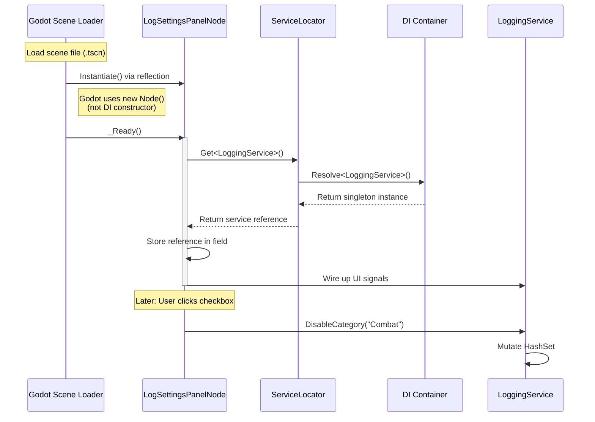

**Why ServiceLocator Here?**

Godot instantiates nodes via scene loading, not DI. We **cannot** use constructor injection. ServiceLocator bridges Godot's instantiation model to our DI container. This is acceptable at the **framework boundary**—it's isolated to `_Ready()` methods in presentation layer.

---

## Recommendation

### Accept Dev Engineer's Category-Based Proposal

**Reasons**:

1. ✅ **Solves Real User Problem**: Filter by domain (Combat, Movement) matches debugging mental model
2. ✅ **Better Performance**: O(1) category check vs O(N) sink checks
3. ✅ **Simpler Implementation**: ~60 lines vs ~300 lines core logic
4. ✅ **Faster Delivery**: 3-4 hours vs 6-8 hours
5. ✅ **Automatic Categorization**: Extracts from namespaces (zero manual tagging)
6. ✅ **Extensible**: Can add sink toggling later if proven need emerges
7. ✅ **Leverages Serilog**: Uses built-in `Filter.ByIncludingOnly` (battle-tested)

### Optional Enhancements

**Hierarchical Categories** (+30min):
```csharp
EnableCategory("Combat.Attack");  // Fine-grained
EnableCategory("Combat");          // All Combat.*
```

**Presets** (+15min):
```csharp
ApplyPreset("All");            // Everything
ApplyPreset("ErrorsOnly");     // Production debugging
ApplyPreset("CombatDebug");    // Combat + related systems
```

**Save/Load Preferences** (+30min):
```csharp
SaveFilterPreferences();   // Persist to user://log_filters.json
LoadFilterPreferences();   // Restore on launch
```

**Total Time**: ~5 hours (vs 6-8 for original)

### Decision Rationale

**Original design is technically sound but over-engineered.**

- Builds flexibility for scenarios that don't exist ("toggle sinks at runtime")
- Doesn't match developer mental model (infrastructure vs domain)
- Reinvents Serilog's built-in filtering
- Higher complexity (300 lines vs 60 lines)
- Longer implementation time (6-8h vs 3-4h)

**Category-based design solves the actual problem**:
- Matches real debugging workflows ("hide Combat spam")
- Leverages Serilog's native capabilities
- Simpler, faster, more maintainable
- Can add sink toggling later if needed (YAGNI principle)

---

## Appendix: Event Flow Timeline

### Original Design Timeline

```
[15:23:45.123] Core logs "Attack executed"
      ↓
[15:23:45.124] Check level (Information >= Debug?) ✅
      ↓
[15:23:45.125] ConditionalConsoleSink.Emit()
      ├─ Check toggles["Console"].IsEnabled → true ✅
      └─ Console.WriteLine("[INFO] Attack executed")
      ↓
[15:23:45.126] ConditionalFileSink.Emit()
      ├─ Check toggles["File"].IsEnabled → true ✅
      └─ File.AppendText("2025-09-30 [INFO] Attack executed")
      ↓
[15:23:45.127] ConditionalGodotSink.Emit()
      ├─ Check toggles["Godot"].IsEnabled → true ✅
      └─ RichTextLabel.CallDeferred(AppendText, ...)

Total: 1 level check + 3 sink checks = 4 conditionals
```

### Proposed Design Timeline

```
[15:23:45.123] Core logs "Attack executed"
      ↓
[15:23:45.124] Check level (Information >= Debug?) ✅
      ↓
[15:23:45.125] Filter.ByIncludingOnly
      ├─ Extract SourceContext → "...Commands.Combat.ExecuteAttackCommandHandler"
      ├─ Parse category → "Combat"
      └─ Check enabledCategories.Contains("Combat") → true ✅
      ↓
[15:23:45.126] Pass to all sinks in parallel
      ├─ ConsoleSink.Emit() → Console.WriteLine(...)
      ├─ FileSink.Emit() → File.AppendText(...)
      └─ GodotSink.Emit() → RichTextLabel.CallDeferred(...)

Total: 1 level check + 1 category check = 2 conditionals
```

---

**End of Document**