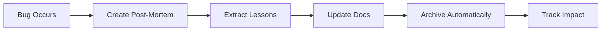

# Post-Mortem Archiving Protocol

## The Philosophy: Learn → Apply → Archive

Post-mortems are **learning vehicles, not permanent fixtures**. They flow through our system with purpose and exit gracefully.

## The Elegant Flow



## The Structure

```
Post-Mortems/
├── ARCHIVING_PROTOCOL.md      (this file)
├── PostMortem_Template.md      (for new post-mortems)
├── Archive/
│   ├── INDEX.md               (searchable master list)
│   └── YYYY-MM-DD-Topic/      (archived items)
│       ├── EXTRACTED_LESSONS.md
│       ├── IMPACT_METRICS.md
│       └── [original files]
└── [active post-mortems only]
```

## The Rules

### Rule 1: One-Way Flow
Once archived, never un-archive. This prevents document decay and forces proper extraction.

### Rule 2: Immediate Archiving
The moment lessons are consolidated, archive. No "I'll do it later" - later never comes.

### Rule 3: Complete Extraction
Before archiving, ALL lessons must be extracted to:
- **QuickReference.md** - Technical gotchas
- **Workflow.md** - Process improvements  
- **Context7Examples.md** - API confusions
- **Testing.md** - Test patterns

### Rule 4: Track Impact
Every archive includes IMPACT_METRICS.md to measure if lessons actually prevent future bugs.

## The Process (Debugger Expert Executes)

### Step 1: Consolidate
```bash
# Read post-mortems
# Extract patterns
# Update relevant docs
```

### Step 2: Create Archive
```bash
date  # MANDATORY - get current date
mkdir -p "Archive/YYYY-MM-DD-Topic/"
```

### Step 3: Document Extraction
Create `EXTRACTED_LESSONS.md`:
- What was learned
- Where it was documented
- Expected impact

### Step 4: Setup Tracking
Create `IMPACT_METRICS.md`:
- Baseline metrics
- Success indicators
- Review schedule

### Step 5: Move Files
```bash
mv *.md Archive/YYYY-MM-DD-Topic/
```

### Step 6: Update Index
Add entry to `Archive/INDEX.md` with searchable tags.

## Why This Works

### Self-Cleaning
The system maintains itself. No manual cleanup needed.

### Forced Learning
Can't archive without extracting lessons. Forces immediate value capture.

### Measurable Impact  
IMPACT_METRICS.md proves whether lessons actually help.

### Clean Workspace
Active directory only contains current issues. No clutter.

## The Iron Rule

> **"A post-mortem in the active directory is a failure of the Debugger Expert"**

This isn't optional. It's mandatory. Post-mortems left unconsolidated become stale knowledge that helps no one.

## Success Metrics

- **Active post-mortems**: Should be 0-2 max
- **Archive growth**: Steady, with complete extraction
- **Impact tracking**: Shows reduction in similar bugs
- **Doc updates**: Every archive creates doc improvements

## Remember

Post-mortems are meant to make us better, not to be collected. The automatic archiving ensures they fulfill their purpose: **preventing future bugs through applied learning**.

---
*Protocol owned by Debugger Expert - Execution is mandatory, not optional*