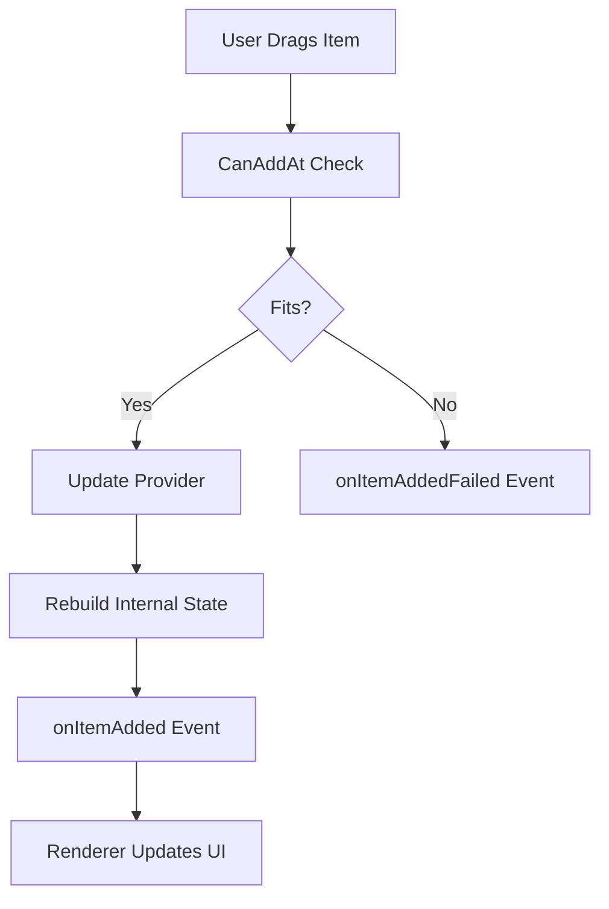

# Inventory System Analysis: Unity Implementation & Design Adaptation

## Executive Summary

This document analyzes multiple inventory system implementations to inform the design of Darklands' inventory system. We examine:
- Unity-based Diablo 2-style grid inventory (neighboring project)
- Stoneshard's spatial Tetris-style management
- Neo Scavenger's weight and container nesting
- Battle Brothers' fatigue-based slot system
- Kingdom Come: Deliverance's realistic layered equipment

These systems demonstrate various approaches to inventory management, from pure spatial puzzles to realistic weight/fatigue systems, providing valuable patterns for our domain-driven design approach.

## Part 1: Existing Unity Inventory System Analysis

### Core Architecture

#### 1. Separation of Concerns
The system employs a clean three-layer architecture:

```
IInventoryProvider → InventoryManager → InventoryRenderer
     (Data)            (Logic)            (Presentation)
```

- **IInventoryProvider**: Abstract interface for inventory data sources
- **InventoryManager**: Core business logic and inventory operations
- **InventoryRenderer**: Unity-specific UI rendering
- **InventoryController**: User input handling and drag/drop

#### 2. Key Components

##### InventoryManager (Core Logic)
- **Responsibilities**:
  - Grid space management (2D array conceptually)
  - Item placement validation
  - Collision detection
  - Event notification system
  - Resizing with item dropping

- **Notable Features**:
  ```csharp
  // Event-driven architecture
  Action<IInventoryItem> onItemAdded;
  Action<IInventoryItem> onItemRemoved;
  Action<IInventoryItem> onItemDropped;

  // Spatial queries
  bool CanAddAt(IInventoryItem item, Vector2Int point);
  IInventoryItem GetAtPoint(Vector2Int point);
  IInventoryItem[] GetAtPoint(Vector2Int point, Vector2Int size);
  ```

##### IInventoryItem Interface
Defines the contract for items:
```csharp
public interface IInventoryItem {
    Sprite sprite { get; }
    Vector2Int position { get; set; }
    int width { get; }
    int height { get; }
    bool IsPartOfShape(Vector2Int localPosition);
    bool canDrop { get; }
}
```

##### InventoryShape System
Supports custom item shapes beyond rectangles:
```csharp
public class InventoryShape {
    private bool[] _shape;  // Bitmask for custom shapes
    public bool IsPartOfShape(Vector2Int localPoint);
}
```

This allows for L-shaped, T-shaped, or other irregular items.

### Control Flow

#### Item Addition Flow


#### Drag & Drop Flow
1. **OnPointerDown**: Identify item at grid position
2. **OnBeginDrag**: Remove item from inventory, create dragged visual
3. **OnDrag**: Update visual position
4. **OnEndDrag**: Attempt placement or return/drop

### Strengths of the Design

1. **Clean Abstraction**: Provider pattern allows multiple inventory sources
2. **Event-Driven**: Decoupled components communicate via events
3. **Spatial Intelligence**: Efficient collision detection and shape support
4. **Robust Validation**: Comprehensive "Can" checks before operations
5. **Unity-Agnostic Core**: Business logic separated from Unity specifics

### Limitations for Our Use Case

1. **No Weight System**: Only spatial constraints
2. **No Container Nesting**: Single-level inventory only
3. **No Item Condition/Durability**: Items are stateless
4. **No Stacking Logic**: Each item occupies unique space
5. **No Equipment Slots**: Though mentioned, not fully implemented

## Part 2: Game System Comparative Analysis

### Stoneshard Inventory Features
- **Grid-based Tetris system**: Items have varied shapes (6x8, 9x9 for pelts)
- **Strategic constraints**: Limited space forces tough decisions
- **Caravan storage**: External storage with 200-600 slots
- **Resource management**: Must balance food, water, medicine, tools vs loot
- **Weight as secondary constraint**: Space is primary limitation

### Neo Scavenger Inventory Features
- **Dual constraints**: Both spatial grid AND weight limits
- **Container efficiency**: Bags provide more internal space than they occupy
  - Canvas Backpack: 238% space efficiency (6x7 external, 10x10 internal)
  - Duffel Bag: 214% space efficiency (7x4 external, 10x6 internal)
- **Item rotation**: Can rotate items to fit better
- **Nested containers**: Items inside containers
- **Condition degradation**: Items wear over time
- **Burden system**: Encumbrance affects movement and combat

### Battle Brothers Inventory System
- **Slot-based system**: Single slots per item, not grid-based
- **Fatigue penalty**: Carried items reduce maximum fatigue in combat
  - Even items in bags count against fatigue
  - Forces tactical decisions about backup equipment
- **Bag slots**: 2 base slots, expandable to 4 via perks
- **Quick Hands perk**: Essential for utilizing bag slots effectively
- **Stash expansion**:
  - Base: 128-152 slots
  - Donkeys (Legends mod): Increase stash capacity
  - Ambitions: Can unlock cart for additional storage

### Kingdom Come: Deliverance Inventory System
- **Realistic layered armor**: 20 total equipment slots with 4 armor layers
  - Chest: 6 slots (hood/gorget, chest armor, shirt/gambeson, tabard, gauntlets, arm armor)
  - Legs: 4 slots (cuisse, poleyns, greaves, footwear)
  - Head: 4 layers possible (coif under helmet)
  - Jewelry: 2 slots
- **Weight system**: Base 70 pounds capacity
  - Strength increases capacity (4 pounds per level)
  - Mule perks add 15-25 pounds
  - Overencumbrance prevents jumping, sprinting, fast travel
- **Categorized tabs**: Armor, Weapons, Food, Quest Items, Other
- **Item condition**: Armor deteriorates, requires cleaning and repair
- **Social implications**: Clean noble clothes for parties, rags for beggars
- **Horse storage**: Additional inventory with saddlebags

## Part 3: Comparative System Analysis

### Inventory Constraint Models

| System | Primary Constraint | Secondary Constraint | Tertiary Constraint |
|--------|-------------------|---------------------|-------------------|
| **Unity/Diablo 2** | Spatial (Grid) | - | - |
| **Stoneshard** | Spatial (Tetris) | Weight | - |
| **Neo Scavenger** | Weight | Spatial (Grid) | Container Nesting |
| **Battle Brothers** | Slot Count | Fatigue Penalty | - |
| **Kingdom Come** | Weight | Equipment Slots | Item Condition |

### Key Design Patterns

#### 1. Constraint Systems
- **Pure Spatial** (Unity/Diablo): Focus on puzzle-solving
- **Weight-Primary** (Neo Scavenger/KCD): Realistic encumbrance
- **Fatigue-Based** (Battle Brothers): Combat effectiveness trade-offs
- **Hybrid** (Stoneshard): Balances multiple constraints

#### 2. Container Approaches
- **Flat** (Battle Brothers): Simple slot-based
- **Nested** (Neo Scavenger): Containers within containers
- **Layered** (Kingdom Come): Equipment layering system
- **External** (Stoneshard): Separate caravan/cart storage

#### 3. Item Degradation
- **None** (Unity, Battle Brothers)
- **Simple** (Neo Scavenger): Condition percentage
- **Complex** (Kingdom Come): Cleaning, repair, social implications

#### 4. UI/UX Patterns
- **Drag & Drop Grid** (Unity, Stoneshard, Neo Scavenger)
- **List with Categories** (Kingdom Come)
- **Slot-based Icons** (Battle Brothers)

## Part 4: Design Synthesis for Darklands

### Recommended Hybrid Approach

Based on analyzing all five systems, I recommend a hybrid approach that combines:

1. **Neo Scavenger's container efficiency** - Creates interesting decisions
2. **Battle Brothers' fatigue system** - Adds combat consequences
3. **Kingdom Come's layered equipment** - Realistic and immersive
4. **Stoneshard's spatial puzzles** - Engaging inventory management
5. **Unity system's clean architecture** - Solid technical foundation

### Core Design Principles

#### 1. Multi-Constraint System
```csharp
public class InventoryConstraints {
    public Weight MaxWeight { get; set; }           // Primary
    public int MaxFatigue { get; set; }             // Secondary
    public GridDimensions GridSize { get; set; }    // Tertiary

    public Result Validate(IEnumerable<InventoryItem> items) {
        // Check all three constraints
        var weightCheck = ValidateWeight(items);
        var fatigueCheck = ValidateFatigue(items);
        var spatialCheck = ValidateSpatial(items);

        return Result.Combine(weightCheck, fatigueCheck, spatialCheck);
    }
}
```

#### 2. Layered Equipment System
```csharp
public enum EquipmentLayer {
    Undergarment = 0,  // Shirt, pants
    Padding = 1,       // Gambeson, padding
    Mail = 2,          // Chainmail
    Plate = 3,         // Plate armor
    Outer = 4          // Tabard, cloak
}

public class LayeredEquipmentSlot {
    private readonly Dictionary<EquipmentLayer, EquipmentItem> _layers;

    public Result<EquipmentItem> Equip(EquipmentItem item) {
        if (_layers.ContainsKey(item.Layer)) {
            return Result.Failure("Layer already occupied");
        }
        _layers[item.Layer] = item;
        return Result.Success(item);
    }
}
```

#### 3. Container Efficiency System
```csharp
public class ContainerItem : InventoryItem {
    public GridDimensions ExternalSize { get; set; }
    public GridDimensions InternalSize { get; set; }

    public decimal SpaceEfficiency =>
        (InternalSize.Width * InternalSize.Height) /
        (ExternalSize.Width * ExternalSize.Height) * 100;

    public int FatigueReduction { get; set; } // Reduces fatigue of items inside
}
```

## Part 5: Enhanced Design Adaptation for Darklands

### Proposed Architecture (Following Phased Implementation)

#### Phase 1: Domain Layer
```csharp
// Core domain entities
public class InventoryGrid : Entity {
    private readonly GridCell[,] _cells;
    private readonly int _width, _height;
    public Result<ItemPlacement> TryPlace(InventoryItem item, Position position);
    public IEnumerable<InventoryItem> GetOverlappingItems(Rectangle area);
}

public class InventoryItem : Entity {
    public ItemShape Shape { get; private set; }
    public Weight Weight { get; private set; }
    public ItemCondition Condition { get; private set; }
    public bool CanRotate { get; private set; }
    public bool CanStack { get; private set; }
}

public class Container : InventoryItem {
    public InventoryGrid InternalGrid { get; private set; }
    public decimal SpaceEfficiency { get; private set; }
}
```

#### Phase 2: Application Layer
```csharp
// Commands and Handlers
public record PlaceItemCommand(
    ActorId ActorId,
    ItemId ItemId,
    Position Position,
    ContainerId? TargetContainer = null
) : ICommand<Result<ItemPlacement>>;

public class PlaceItemCommandHandler : ICommandHandler<PlaceItemCommand> {
    // Validates weight limits, spatial constraints, container rules
}

// Domain Events
public record ItemPlacedEvent(
    ActorId ActorId,
    ItemId ItemId,
    Position Position,
    ContainerId? Container
) : IDomainEvent;
```

#### Phase 3: Infrastructure Layer
```csharp
// State management
public class InventoryState : IInventoryState {
    private readonly Dictionary<ActorId, ActorInventory> _inventories;
    public Result<InventoryGrid> GetInventory(ActorId actorId);
}

// Godot-specific rendering adapter
public class GodotInventoryRenderer : IInventoryRenderer {
    // Converts domain models to Godot visuals
}
```

#### Phase 4: Presentation Layer
```gdscript
# Godot UI components
extends Control
class_name InventoryUI

var inventory_state: InventoryState
var drag_preview: DragPreview

func _on_item_drag_started(item: InventoryItem):
    drag_preview.show_item(item)
```

### Key Adaptations from All Systems

#### 1. Enhanced Item Model
```csharp
public class EnhancedInventoryItem : InventoryItem {
    // From Unity system
    public ItemShape Shape { get; set; }
    public Position GridPosition { get; set; }

    // From Neo Scavenger
    public Weight Weight { get; set; }
    public ItemRotation Rotation { get; set; }
    public ContainerId? ParentContainer { get; set; }

    // From Battle Brothers
    public int FatigueCost { get; set; }
    public bool RequiresQuickHands { get; set; }

    // From Kingdom Come
    public ItemCondition Condition { get; set; }
    public CleanlinessLevel Cleanliness { get; set; }
    public EquipmentLayer? Layer { get; set; }
    public SocialClass RequiredStatus { get; set; }

    // Darklands additions
    public StackSize CurrentStack { get; set; }
    public bool IsQuestItem { get; set; }
}
```

#### 2. Multi-Level Container System
```csharp
public class ContainerHierarchy {
    // Support nested containers like Neo Scavenger
    public Result<Container> GetRootContainer(ItemId itemId);
    public IEnumerable<Container> GetContainerPath(ItemId itemId);
    public decimal CalculateTotalSpaceEfficiency(ContainerId containerId);
}
```

#### 3. Fatigue & Encumbrance System (Battle Brothers + KCD Hybrid)
```csharp
public class FatigueEncumbranceCalculator {
    public CombatReadiness Calculate(ActorId actorId) {
        var inventory = GetActorInventory(actorId);
        var totalWeight = inventory.TotalWeight;
        var totalFatigue = inventory.TotalFatigueCost;
        var strength = GetActorStrength(actorId);

        return new CombatReadiness {
            MaxFatigue = BaseFatigue - totalFatigue,
            MovementSpeed = CalculateSpeed(totalWeight, strength),
            CanSprint = totalWeight <= strength * 0.8,
            CanFastTravel = totalWeight <= strength
        };
    }
}
```

#### 4. Spatial Optimization with Rotation (Neo Scavenger Style)
```csharp
public class InventoryOptimizer {
    // Auto-arrange items for optimal space usage with rotation
    public Result<GridArrangement> OptimizeLayout(
        IEnumerable<InventoryItem> items,
        GridDimensions dimensions,
        bool allowRotation = true
    ) {
        // Try different rotations and positions
        var arrangements = GeneratePossibleArrangements(items, allowRotation);
        return SelectOptimalArrangement(arrangements, dimensions);
    }
}
```

#### 5. Equipment Layering System (Kingdom Come Inspired)
```csharp
public class EquipmentManager {
    private readonly Dictionary<EquipmentSlot, LayeredEquipmentSlot> _slots;

    public Result EquipArmor(ArmorItem armor, EquipmentSlot slot) {
        var layeredSlot = _slots[slot];

        // Check layer compatibility
        if (!IsLayerCompatible(armor.Layer, layeredSlot)) {
            return Result.Failure("Incompatible armor layer");
        }

        // Apply social and cleanliness checks
        if (armor.Cleanliness < MinimumCleanliness) {
            return Result.Warning("Dirty armor may affect social interactions");
        }

        return layeredSlot.Equip(armor);
    }
}
```

### Implementation Strategy

#### Step 1: Core Systems Foundation (Week 1)
- Port Unity InventoryManager grid logic to domain layer
- Implement Neo Scavenger-style rotation support
- Add Battle Brothers fatigue calculations
- Create weight tracking from Kingdom Come

#### Step 2: Container & Layering System (Week 1-2)
- Implement Neo Scavenger nested containers with efficiency
- Add Kingdom Come equipment layering (4 layers)
- Create Battle Brothers bag slot system
- Handle Stoneshard-style external storage (carts/donkeys)

#### Step 3: Constraint Systems (Week 2)
- Integrate weight/fatigue/spatial constraints
- Implement encumbrance effects on movement/combat
- Add Kingdom Come item condition/cleanliness
- Create Battle Brothers Quick Hands perk equivalent

#### Step 4: Advanced Features (Week 2-3)
- Social implications of equipment (Kingdom Come)
- Auto-sort with spatial optimization
- Container efficiency bonuses
- Stacking for consumables only

## Part 4: Technical Considerations

### Performance Optimizations

1. **Spatial Indexing**: Use quadtree for large inventories
2. **Event Batching**: Aggregate multiple changes before UI update
3. **Lazy Loading**: Load container contents only when opened
4. **Object Pooling**: Reuse UI elements (already in Unity system)

### Godot-Specific Adaptations

```gdscript
# Leverage Godot's signal system
signal item_placed(item, position)
signal weight_limit_exceeded(current_weight, max_weight)

# Use Godot's built-in drag and drop
func _can_drop_data(position, data):
    return inventory_manager.can_place_at(data.item, position)
```

### Data Persistence

```csharp
public class InventorySerializer {
    public string SerializeToJson(ActorInventory inventory);
    public ActorInventory DeserializeFromJson(string json);

    // Handle nested containers recursively
    private ContainerData SerializeContainer(Container container);
}
```

## Part 6: Advantages of This Hybrid Approach

### 1. Best of All Worlds
Combines the most engaging mechanics from each system:
- **Spatial puzzles** from Stoneshard/Unity for engagement
- **Fatigue penalties** from Battle Brothers for tactical depth
- **Container efficiency** from Neo Scavenger for strategic choices
- **Equipment layering** from Kingdom Come for realism
- **Clean architecture** from Unity for maintainability

### 2. Progressive Complexity
Players can learn systems incrementally:
- Start with basic grid placement
- Discover weight limits through gameplay
- Learn fatigue impacts in combat
- Master container optimization later

### 3. Domain-Driven Design Alignment
Each system maps to clear domain concepts:
- Unity's Provider → Repository pattern
- Battle Brothers' fatigue → Combat domain
- Kingdom Come's layers → Equipment domain
- Neo Scavenger's containers → Storage domain

### 4. Enhanced Testability
Multiple constraint systems enable comprehensive testing:
```csharp
[Test]
public void PlaceItem_WhenWeightExceedsLimit_ReturnsFailure() {
    // Arrange
    var inventory = new InventoryGrid(10, 10, maxWeight: 50.Kilograms());
    var heavyItem = new InventoryItem { Weight = 51.Kilograms() };

    // Act
    var result = inventory.TryPlace(heavyItem, new Position(0, 0));

    // Assert
    result.Should().BeFailure();
    result.Error.Should().Contain("weight limit");
}
```

## Part 7: Risk Mitigation

### Identified Risks

1. **Complexity Creep**: Combining five systems might overwhelm players
   - **Mitigation**: Implement features progressively, hide advanced mechanics initially
   - **Validation**: Playtest each constraint system independently first

2. **Performance with Multiple Constraints**: Checking weight + fatigue + spatial + layers
   - **Mitigation**: Cache calculations, use dirty flags for updates
   - **Optimization**: Spatial indexing for grid, lazy evaluation for fatigue

3. **UI Complexity**: Managing grids + layers + containers in Godot
   - **Mitigation**: Start with grid only, add tabs for layers like Kingdom Come
   - **Progressive disclosure**: Show advanced UI only when needed

4. **Balancing Multiple Systems**: Fatigue vs weight vs space interactions
   - **Mitigation**: Extensive playtesting, configurable constraint weights
   - **Tuning**: Make each system's impact adjustable via config

5. **Save/Load Complexity**: Layered equipment + nested containers + conditions
   - **Mitigation**: Hierarchical serialization, versioned save format
   - **Testing**: Automated save/load tests for edge cases

## Conclusion

After analyzing five distinct inventory systems, we have identified a hybrid approach that combines their best features:

- **Unity's clean architecture** provides our technical foundation
- **Stoneshard's spatial puzzles** create engaging inventory management
- **Neo Scavenger's container efficiency** adds strategic depth
- **Battle Brothers' fatigue system** introduces combat trade-offs
- **Kingdom Come's equipment layering** brings unprecedented realism

This synthesis creates an inventory system that is both mechanically rich and architecturally sound. The multi-constraint approach (weight + fatigue + spatial + layers) provides multiple axes of player decision-making while maintaining clear domain boundaries for implementation.

### Recommended Next Steps

1. **Immediate**: Create ADR documenting hybrid inventory architecture
2. **Phase 1**: Core grid + rotation + fatigue (Week 1)
3. **Phase 2**: Layered equipment + nested containers (Week 1-2)
4. **Phase 3**: Weight/encumbrance + item conditions (Week 2)
5. **Phase 4**: UI implementation with progressive disclosure (Week 2-3)

### Key Takeaways

- **Architecture**: Unity's event-driven design provides solid foundation
- **Constraints**: Multi-axis constraints (weight/fatigue/spatial) create depth
- **Realism**: Kingdom Come's layering adds immersion without overwhelming
- **Efficiency**: Neo Scavenger's container system rewards clever packing
- **Balance**: Battle Brothers' fatigue creates meaningful combat trade-offs

### Design Philosophy

The ideal inventory system should:
1. Be intuitive at first glance (basic grid)
2. Reveal depth through play (container efficiency, fatigue)
3. Support emergent strategies (equipment combinations, packing optimization)
4. Enhance rather than hinder gameplay (quick access, smart defaults)
5. Feel realistic without being tedious (abstracted cleaning, simplified repairs)

---

*Document created: 2025-09-18*
*Updated: 2025-09-18*
*Analysis based on:*
- *Unity Inventory System (FarrokGames.Inventory) v1.0*
- *Stoneshard (v0.8.2.x)*
- *Neo Scavenger (v1.15)*
- *Battle Brothers + Legends Mod*
- *Kingdom Come: Deliverance (v1.9.6)*